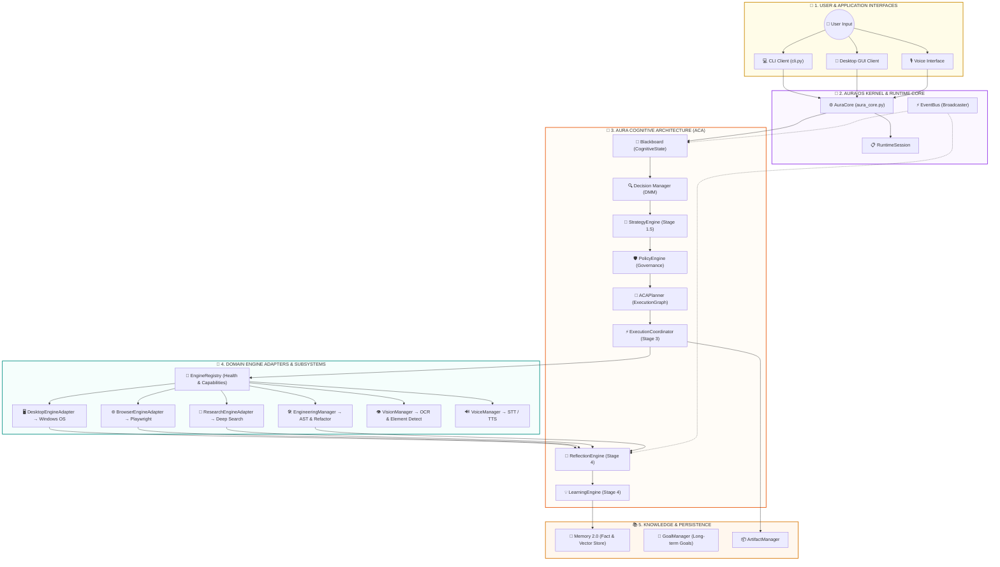

# 🏛️ AuraAI System & Cognitive Architecture Documentation

> **CORE PRINCIPLE:** *"The architecture is largely complete. The runtime is not."*
> Every user request flows through a single cognitive runtime pipeline.

---

## 📊 High-Level Layer Breakdown

| Layer Level | Architecture Layer | Description | Modules | Classes | Functions | Complexity |
| :---: | :--- | :--- | :---: | :---: | :---: | :---: |
| **1** | 🚀 **Applications & Clients** | CLI, GUI, REST/WS API servers, main entry points | 17 | 11 | 118 | 243 |
| **2** | 👑 **OS Kernel & Executive Brain** | AuraCore, ExecutiveBrain, RuntimeSession, MasterOrchestrator | 68 | 115 | 487 | 1554 |
| **3** | 🧠 **Cognitive Architecture (ACA)** | Cognitive Pipeline: Perception, DMM, Strategy, Policy, Planner, Coordinator, Reflection, Learning | 46 | 109 | 328 | 1135 |
| **4** | 🎯 **Domain Subsystems & Engines** | Desktop, Browser, Research, Engineering, Vision, Voice engines and adapters | 190 | 433 | 2554 | 5685 |
| **5** | 📚 **Memory & Knowledge Base** | Fact store, vector store, long-term memory, knowledge graphs, SQLite | 35 | 49 | 422 | 861 |
| **6** | 🏛️ **Infrastructure & Event Bus** | EventBus, Logger, Base Contracts, Configuration, Shared Schemas | 154 | 146 | 1234 | 3081 |
| **7** | 🔌 **Tool Execution & Plugins** | Plugins, Tool Registry, Extension Kits | 11 | 22 | 101 | 255 |

---

## 🔁 Continuous Agent Decision & Cognitive Pipeline Flow

---

## 🛡️ Guardrail Rules & Component Layer Contracts

1. **Single Entry Point**: All user requests enter through `AuraCore.process_request()`.
2. **Guardrail 1 Decoupling**: No domain backend (`src/desktop`, `src/browser`, `src/research`, `src/engineering`, `src/vision`) may import from `src.brain.aca`.
3. **Single Coordinator**: Only `ExecutionCoordinator` invokes execution engines via `EngineRegistry` & `EngineAdapters`.
4. **Shared Blackboard**: All stages read from and write to `Blackboard` (`CognitiveState`).

*Generated automatically on 2026-08-07 03:06:34 by `generate_architecture.py`.*