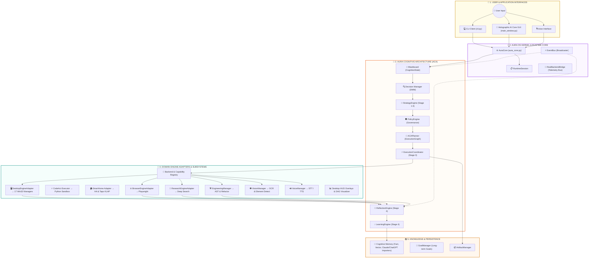

# 🏛️ AuraAI System & Cognitive Architecture Documentation

> **CORE PRINCIPLE:** *"The architecture is largely complete. The runtime is not."*
> Every user request flows through a single cognitive runtime pipeline.

---

## 📊 High-Level Layer Breakdown

| Layer Level | Architecture Layer | Description | Modules | Classes | Functions | Complexity |
| :---: | :--- | :--- | :---: | :---: | :---: | :---: |
| **1** | 🚀 **Applications & Clients** | CLI, GUI, REST/WS API servers, main entry points | 17 | 11 | 118 | 243 |
| **2** | 👑 **OS Kernel & Executive Brain** | AuraCore, ExecutiveBrain, RuntimeSession, MasterOrchestrator | 69 | 117 | 493 | 1599 |
| **3** | 🧠 **Cognitive Architecture (ACA)** | Cognitive Pipeline: Perception, DMM, Strategy, Policy, Planner, Coordinator, Reflection, Learning | 46 | 109 | 328 | 1136 |
| **4** | 🎯 **Domain Subsystems & Engines** | Desktop, Browser, Research, Engineering, Vision, Voice engines and adapters | 192 | 439 | 2572 | 5754 |
| **5** | 📚 **Memory & Knowledge Base** | Fact store, vector store, long-term memory, knowledge graphs, SQLite | 35 | 49 | 422 | 861 |
| **6** | 🏛️ **Infrastructure & Event Bus** | EventBus, Logger, Base Contracts, Configuration, Shared Schemas | 173 | 176 | 1336 | 3535 |
| **7** | 🔌 **Tool Execution & Plugins** | Plugins, Tool Registry, Extension Kits | 11 | 22 | 101 | 255 |

---

## 🔁 Continuous Agent Decision & Cognitive Pipeline Flow

---

## 🛡️ Guardrail Rules & Component Layer Contracts

1. **Single Entry Point**: All user requests enter through `AuraCore.process_request()`.
2. **Guardrail 1 Decoupling**: No domain backend (`src/desktop`, `src/browser`, `src/research`, `src/engineering`, `src/vision`) may import from `src.brain.aca`.
3. **M32 Focus Invariant**: Multi-task state is managed by `FocusManager` using SQLite WAL mode. Named threads isolate working contexts and prevent silent overwrites. Fuzzy match resolves near-duplicates with length-weighted thresholds and fails closed to preserve task context.
4. **M33 Vision Dictation & Referential Memory**:
   - `GroundingEngine`: 3-Tier resolution (Tier 1 A11y/UIA/DOM -> Tier 2 OCR/Vision -> Tier 3 Fail-Closed on $< 0.75$).
   - `VisualWorkingMemory`: In-memory ring buffer (5 items, 3-turn TTL) keyed to `FocusManager.task_id`. Decays automatically on foreground application switch and provides 1-turn alternative correction (`_last_alternative`).
   - `AppContextRouter`: Detects foreground windows and maps verbs to domain engines. Targetless navigation commands (`scroll`, `back`, `forward`) short-circuit with 0 vision token cost.
   - `CryptographicApprovalAuthority`: High-risk verbs (`run`, `fix`, `delete`) require HMAC-SHA256 human approval ticket redemption before execution.
5. **M34 Cognitive Macro Compilation, Speculative Pre-Fetching & Proactive Watcher**:
   - `MacroCompiler`: Compiles repeated verified action traces ($\ge 3$ consecutive runs with identical step signatures, confidence $\ge 0.90$) into zero-token deterministic macros. Scoped by `(intent, app_name, workspace_scope)` to prevent cross-project coordinate leakage. Enforces fail-closed `MacroDriftError` on UI signature mismatch.
   - `SpeculativeIndexer`: Asynchronously pre-warms AST symbols, active editor document structures, and git diff summaries in background threads on foreground window/editor change events, providing $<1\text{ms}$ instant context retrieval.
   - `ProactiveDiagnosticsWatcher`: Low-overhead background daemon that monitors workspace health strictly inside `.aura_staging/` (via `StagingWorkspace`). Enforces state-change cost gating (0 tokens on unchanged workspace), routes non-interrupting notices via `FocusManager.enqueue_notification(severity="LOW")` without stealing focus threads, and enforces 24h staging directory retention ($\le 10$ directories).
6. **M35 Engineering Intelligence 3.0 & Project Indexing**:
   - `ProjectIndex`: High-performance inverted trigram and AST symbol index providing sub-millisecond symbol and text searches across 600+ repository files with fine-grained differential cache invalidation on disk modification events.
   - `DuplicateDetector`: Multi-tier duplicate code analysis pipeline evaluating AST structural representations, token similarity metrics, and facade exemptions to detect redundant logic, copy-paste drift, and unmaintained shims.
   - `SymbolGraph` & `CodeEditor`: Transactional multi-file AST symbol dependency tracking and atomic editing with byte-exact snapshot rollbacks.
7. **AI Provider Resiliency & Key Rotation Pool**:
   - `KeyPool`: Thread-safe multi-account API key check-out and rotation pool with automatic exponential cooldown on HTTP 429 / resource exhaustion errors.
   - `GeminiProvider`: Multi-tier fallback hierarchy with schema-enforced structured JSON output and explicit exception isolation.
8. **Continuous Voice Perception & Wake-Word Pipeline**:
   - `ContinuousLoop`: Asynchronous finite state machine (`IDLE`, `LISTENING`, `PROCESSING`, `SPEAKING`, `ERROR`) driving streaming speech recognition and speech synthesis.
   - `VoiceNotchOverlay`: Always-on-top Win32 `HWND_TOPMOST` Dynamic Island HUD with real-time microphone spectrum visualizer, live focus thread chips, and 60-second watchdog task protection.
   - Wake Word Auto-Saver: Vocal alignment, audio normalization, and 0.5s post-trigger tail retention auto-saving triggered wake phrases directly into positive training datasets.
9. **Single Coordinator**: Only `ExecutionCoordinator` invokes execution engines via `EngineRegistry` & `EngineAdapters`.
10. **Shared Blackboard**: All stages read from and write to `Blackboard` (`CognitiveState`).