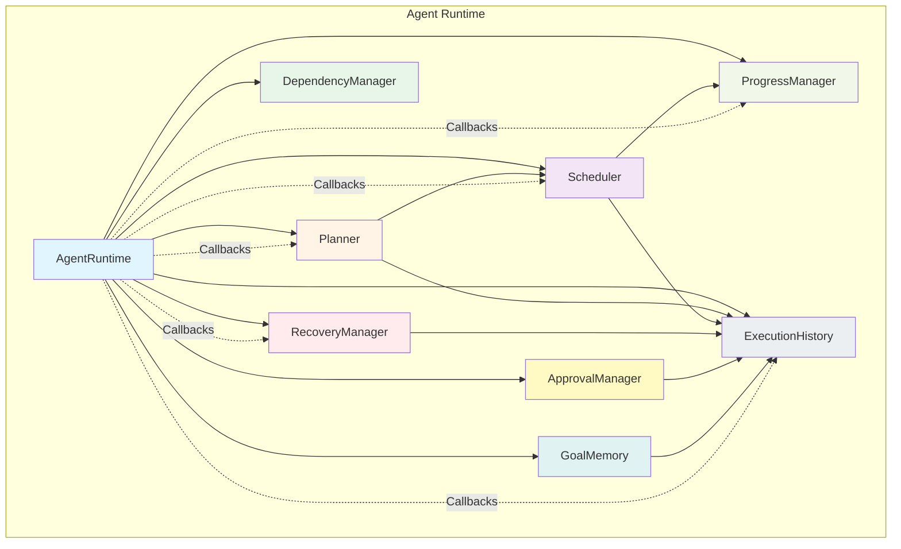

# Aura

An AI OS companion shell for Windows. Sprint 1 focuses on the native desktop
experience: a control center window, system tray presence, dark theme,
overlay prompt, and Alt + Space activation.

## Structure
- src/ - application source code
- assets/ - images and static files
- database/ - database files and models
- plugins/ - extension/plugin modules
- tests/ - test suite
- docs/ - documentation

## Aura Shell
- `src/gui/main_window.py` - frameless desktop control center
- `src/gui/titlebar.py` - custom draggable title bar
- `src/gui/overlay.py` - Alt + Space assistant overlay
- `src/gui/tray.py` - Windows system tray integration
- `src/gui/theme.py` - shared dark theme engine
- `src/gui/animations.py` - reusable UI animation helpers
- `src/core/app.py` - application bootstrap and lifecycle
- `src/core/config.py` - app constants and runtime paths
- `src/core/event_bus.py` - decoupled app-wide messaging
- `src/core/settings.py` - persistent user settings
- `src/core/plugin_manager.py` - plugin discovery and loading
- `src/core/window_manager.py` - GUI window orchestration
- `src/core/overlay_manager.py` - overlay prompt handling
- `src/core/live_screen.py` - continuous screen capture session manager
- `src/core/screen_context.py` - screenshot and latest-frame capture helpers

## Setup
1. Activate the virtual environment
2. Install dependencies: `pip install -r requirements.txt`
3. Add your API keys to `.env`

## Run
```powershell
python src/main.py
```

Close the main window to keep Aura running in the tray. Use Alt + Space to open
the overlay, or choose "Show Overlay" from the tray menu.

If the local `.venv` launcher is broken, use the bundled-runtime launcher:
```powershell
.\scripts\run_aura.ps1
```

## Tool Execution Engine

Aura AI includes a powerful, unified tool execution engine that provides a secure,
reliable, and feature-rich execution pipeline for all tool operations. The execution
engine implements a comprehensive 8-stage pipeline:

```
Request → Validation → Permission → Preparation → Execution → Monitoring → Completion → Cleanup → Result
```

### Core Components

#### 1. Tool Interface ([tool_interface.py](src/execution/tool_interface.py))
Abstract base class defining the contract for all tools. Tools must implement:
- `execute(operation, parameters, context)` - Main execution method
- `get_metadata()` - Return tool metadata
- `get_supported_operations()` - List supported operations
- `requires_confirmation(operation)` - Check if permission is required

#### 2. Tool Registry ([tool_registry.py](src/execution/tool_registry.py))
Manages tool registration and lifecycle. Features:
- Dynamic tool registration and discovery
- Operation validation
- Tool metadata management
- Built-in tool adapters (FunctionToolAdapter, ClassToolAdapter)

#### 3. Execution Engine ([execution_engine.py](src/execution/execution_engine.py))
Core orchestration component that coordinates all tool executions:
- Unified interface for tool execution
- Permission and risk management
- Timeout handling and cancellation support
- Progress tracking and logging
- Result formatting

#### 4. Permission Manager ([permission_manager.py](src/execution/permission_manager.py))
Implements risk-based access control with four permission levels:
- **SAFE** - Read-only operations (e.g., READ_FILE, ACCESS_CLIPBOARD)
- **MEDIUM** - Non-destructive operations (e.g., WRITE_FILE, EXECUTE_COMMAND)
- **HIGH** - Destructive operations (e.g., DELETE_FILE, MODIFY_REGISTRY)
- **CRITICAL** - System-level operations (e.g., SHUTDOWN_SYSTEM, FORMAT_DISK)

Includes `PermissionAction` enum defining all permission types and `REQUIRED_PERMISSIONS`
mappings from actions to required permission levels.

#### 5. Risk Analyzer ([risk_analyzer.py](src/execution/risk_analyzer.py))
Analyzes operations and determines risk level and confirmation requirements:
- `check_if_confirmation_required(tool_name, operation, parameters)` - Returns
  (requires_confirm, risk_level, suggested_permissions)
- Risk levels: LOW, MEDIUM, HIGH, CRITICAL
- Context-aware risk assessment

#### 6. Execution State ([execution_state.py](src/execution/execution_state.py))
Tracks execution lifecycle with:
- Progress tracking (0.0 - 100.0)
- Status history and logging
- Permission requests and grants
- Cancellation support
- Metadata storage
- Thread-safe operations using RLock()

#### 7. Progress Tracker ([progress_tracker.py](src/execution/progress_tracker.py))
Provides progress updates with callbacks:
- Real-time progress reporting
- Log and warning collection
- Success/failure tracking
- Customizable update callbacks

#### 8. Cancellation Support ([cancellation.py](src/execution/cancellation.py))
Safe cancellation system:
- `CancellationToken` for tracking cancellation state
- `CancellationHandler` for managing cancellation
- `CancellationError` for handling cancelled operations
- Thread-safe cancellation checks

#### 9. Timeout Monitor ([timeout_manager.py](src/execution/timeout_manager.py))
Handles operation timeouts:
- Configurable timeout duration
- Timeout detection and reporting
- Integration with execution engine

#### 10. Tool Execution Result ([result.py](src/execution/result.py))
Standardized result formatting:
- `ToolExecutionResult` dataclass for success results
- `ToolExecutionResult.error_result()` for error results
- Metadata and logging tracking
- Integration with ExecutionState

#### 11. ToolExecutionResult Class
Execution result with:
- `success`, `output`, `error` properties
- `execution_id`, `execution_time`, `affected_files`, `affected_directories`
- `next_suggestions`, `execution_metadata`
- Factory methods: `success_result()`, `error_result()`

#### 12. Execution State ([execution_state.py](src/execution/execution_state.py))
Tracks execution state with:
- Status: PENDING, VALIDATING, PREPARING, RUNNING, COMPLETED, FAILED, CANCELLED, TIMEOUT
- Progress: float (0.0 - 100.0)
- Permissions requested/granted/denied
- Risk level and timeout tracking
- Thread-safe operations with RLock()

#### 13. Tool Metadata Class
Metadata container with:
- `name`, `category`, `version`, `description`, `author`
- `tags`, `capabilities`, `requires_confirmation`
- `to_dict()` method for serialization

#### 14. Tool Categories Enum ([tool_interface.py](src/execution/tool_interface.py))
Supported categories:
- FILESYSTEM, DESKTOP, BROWSER, GIT, TERMINAL, VISION, VOICE
- KNOWLEDGE, NETWORKING, DOCKER, OFFICE, EMAIL, CALENDAR, MCP, GENERAL

#### 15. Execution Status Enum ([execution_state.py](src/execution/execution_state.py))
Status values:
- PENDING, VALIDATING, PREPARING, RUNNING, COMPLETED, FAILED, CANCELLED, TIMEOUT

### Permission System

#### Permission Actions ([permission_manager.py](src/execution/permission_manager.py))
15 permission types:
- READ_FILE, WRITE_FILE, DELETE_FILE, RENAME_FILE
- EXECUTE_COMMAND, SHUTDOWN_SYSTEM, FORMAT_DISK
- MODIFY_REGISTRY, DELETE_SYSTEM32
- OPEN_APPLICATION, CLOSE_APPLICATION
- ACCESS_CLIPBOARD, NETWORK_ACCESS, MAIL_SEND, CALENDAR_MODIFY

#### Permission Level Requirements
```python
REQUIRED_PERMISSIONS = {
    PermissionAction.READ_FILE: PermissionLevel.SAFE,
    PermissionAction.WRITE_FILE: PermissionLevel.MEDIUM,
    PermissionAction.DELETE_FILE: PermissionLevel.HIGH,
    PermissionAction.EXECUTE_COMMAND: PermissionLevel.MEDIUM,
    # ... etc
}
```

### Usage Example

```python
from execution import (
    ExecutionEngine,
    ToolRegistry,
    FunctionToolAdapter,
    ToolMetadata,
    ToolCategory
)

# Create a simple function tool
def read_file(name: str) -> dict:
    return {"content": f"File contents of {name}"}

# Create tool adapter
adapter = FunctionToolAdapter(
    name="file_reader",
    function=read_file,
    description="Read a file",
    category=ToolCategory.FILESYSTEM,
    capabilities=["read", "write", "delete"]
)

# Initialize execution engine
engine = ExecutionEngine(
    default_timeout=30,
    require_confirmation=True
)

# Register tool
engine.tool_registry.register_tool(adapter)

# Execute tool
result = engine.execute_tool(
    tool_name="file_reader",
    operation="read",
    parameters={"name": "test.txt"}
)

if result.success:
    print(f"Success: {result.output}")
else:
    print(f"Error: {result.error}")
```

### Brain Integration

The Tool Execution Engine integrates seamlessly with AuraBrain ([brain_integration.py](src/brain/brain_integration.py)):
- Unified interface for tool execution
- Backward compatibility with ToolRouter
- Automatic tool registration
- Result formatting for AuraBrain

```python
from brain.brain_integration import BrainIntegration

integration = BrainIntegration(
    workspace_manager=workspace_manager,
    tool_router=existing_tool_router
)
integration.initialize()

result = integration.execute_tool("file_writer", "write", {"content": "hello"})
```

### Architecture

The execution engine follows a modular architecture:
- **Abstraction Layer**: ToolInterface defines the contract
- **Orchestration Layer**: ExecutionEngine coordinates the pipeline
- **Support Layer**: Permission, risk, timeout, and cancellation modules
- **Integration Layer**: BrainIntegration bridges with AuraBrain

### Security Features

1. **Risk-Based Access Control**: Four permission levels with automatic assessment
2. **Confirmation Requirements**: Risky operations require user confirmation
3. **Timeout Protection**: Operations have configurable timeouts
4. **Cancellation Support**: Safe, thread-safe operation cancellation
5. **Audit Logging**: Complete execution history and logging

### Testing

The engine includes comprehensive integration tests ([test_integration.py](test_integration.py)):
- Module imports
- Execution engine creation
- Tool registration and execution
- Permission and risk management
- State tracking and result formatting
- Brain integration

All tests pass successfully:
```powershell
python test_integration.py
```

### Key Features

✓ **Unified Interface**: Single entry point for all tool executions
✓ **Thread-Safe**: Uses RLock() for concurrent execution
✓ **Secure**: Risk-based permission system with confirmation requirements
✓ **Flexible**: Adapters for function and class-based tools
✓ **Monitorable**: Real-time progress tracking and logging
✓ **Reliable**: Timeout handling and cancellation support
✓ **Extensible**: Easy to add new tools and categories
✓ **Integrated**: Works seamlessly with AuraBrain and existing ToolRouter

### Plugin Ecosystem

Aura features a modular plugin architecture that allows developers to extend Aura's capabilities dynamically. Plugins are self-contained Python modules that follow a consistent lifecycle.

#### Plugin Categories

- **desktop** - Desktop automation and UI control
- **filesystem** - File operations, search, manipulation
- **browser** - Browser automation, scraping, APIs
- **terminal** - Terminal commands, shell operations
- **git** - Git operations, repository management
- **networking** - HTTP requests, web scraping, network tools
- **vision** - Image analysis, OCR, computer vision
- **voice** - Voice recognition, synthesis, audio processing
- **office** - Office document manipulation (Word, Excel, PDF)
- **email** - Email sending, reading, automation
- **calendar** - Calendar events, reminders, scheduling
- **knowledge** - Knowledge base management, search
- **docker** - Docker container management
- **database** - Database queries, CRUD operations
- **mcp** - Model Context Protocol servers

#### Core Components

1. **Plugin Interface** ([plugin_interface.py](src/plugins/plugin_interface.py))
   - Abstract base class for all plugins
   - Defines plugin lifecycle: load, initialize, execute, shutdown
   - Capability and permission management

2. **Plugin Registry** ([plugin_registry.py](src/plugins/plugin_registry.py))
   - Central management system for all plugins
   - Auto-discovery and scanning
   - Capability routing and routing
   - Dependency resolution and health monitoring

3. **Plugin Manager** ([plugin_manager.py](src/plugins/plugin_manager.py))
   - Orchestrates plugin lifecycle
   - Coordinates execution through capabilities
   - Event system for plugin communication
   - Enable/disable/reload support

#### Creating a Plugin

**Option 1: Using the CLI**

```bash
aura-plugin-cli create-plugin my_plugin filesystem
```

**Option 2: Using the Manifest Generator**

```python
from plugins.shared.plugin_sdk.manifest_generator import PluginManifestGenerator

generator = (
    PluginManifestGenerator(name="my_plugin", category="filesystem")
    .set_author("Your Name")
    .set_description("My plugin does cool things")
    .add_capability("read_file")
    .add_capability("write_file")
    .save()
)
```

**Option 3: Manual Creation**

1. Create a directory in `plugins/<category>/`
2. Create `my_plugin.py` implementing the `Plugin` class
3. Create `_manifest.json` with metadata
4. Create `__init__.py` and `README.md`

See [plugin_sdk.md](docs/plugin_sdk.md) for complete documentation.

#### Example Plugin

```python
import logging
from typing import Any
from src.plugins.plugin_interface import Plugin, PluginManifest


class MyPlugin(Plugin):
    """Your plugin description."""

    def __init__(self, manifest: PluginManifest):
        super().__init__(manifest)

    def load(self) -> bool:
        logger.info(f"Loading plugin: {self.manifest.name}")
        # Register capabilities
        for capability in self.manifest.capabilities:
            self.register_capability(capability, self._handle_capability)
        return True

    def initialize(self) -> bool:
        logger.info(f"Initializing plugin: {self.manifest.name}")
        self.state = "ready"
        return True

    def execute(self, capability: str, **kwargs) -> Any:
        handler = self.get_capability_handler(capability)
        return handler(**kwargs)

    def _handle_capability(self, **kwargs) -> Any:
        # Implement your logic here
        return {"status": "success"}

    def shutdown(self) -> bool:
        logger.info(f"Shutting down plugin: {self.manifest.name}")
        return True
```

#### Vision System Plugin ([vision_plugin.py](src/vision/vision_plugin.py))

Aura now has "eyes" with the Vision System plugin, providing comprehensive image analysis capabilities:

**Features:**
- **Screenshot Capture** - Full screen, active monitor, active window, selected region, window by title, menu/dialog capture
- **Object Detection** - Buttons, menus, dialogs, paragraphs, table regions
- **Layout Analysis** - Title bar, menu bar, content area, footer, scrollbars, sidebar, margins, columns, sections
- **UI Analysis** - Buttons, menus, dialogs, forms, notifications, tooltips, inputs, checkboxes, radio buttons, dropdowns
- **Diagram Analysis** - Flowcharts, network diagrams, circuit diagrams, nodes, connections, sections
- **Code Detection** - Language detection, code lines, snippets, syntax highlighting
- **Plugin Integration** - Full Plugin System support with configuration management

**Usage Example:**
```python
from src.vision.vision_plugin import VisionPlugin

# Initialize plugin
plugin = VisionPlugin()

# Load plugin
plugin.load(config={
    'enabled': True,
    'features': {
        'object_detection': True,
        'ui_analysis': True,
        'diagram_analysis': True
    }
})

# Capture and analyze screenshot
result = plugin.capture_and_analyze()
print(f"Buttons found: {len(result['buttons'])}")
print(f"Menus found: {len(result['menus'])}")

# Analyze specific window
result = plugin.capture_active_window_and_analyze(window_title="Chrome")
print(f"UI Analysis: {result['ui_analysis']}")
```

**Documentation:** See [docs/VISION_SYSTEM.md](docs/VISION_SYSTEM.md) for complete Vision System documentation.

**Testing:**
```powershell
pytest tests/test_vision_system.py -v
```

**Key Components:**
- [vision_manager.py](src/vision/vision_manager.py) - Main orchestrator
- [screenshot_manager.py](src/vision/screenshot_manager.py) - Screenshot capture (6 methods)
- [object_detector.py](src/vision/object_detector.py) - Object detection
- [layout_analyzer.py](src/vision/layout_analyzer.py) - Layout analysis
- [ui_analyzer.py](src/vision/ui_analyzer.py) - UI element analysis
- [diagram_analyzer.py](src/vision/diagram_analyzer.py) - Diagram analysis
- [code_detector.py](src/vision/code_detector.py) - Code detection
- [image_loader.py](src/vision/image_loader.py) - Image loading
- [preprocessing.py](src/vision/preprocessing.py) - Image preprocessing

#### Testing Plugins

Run the integration test to verify your plugin system:

```powershell
python test_plugin_integration.py
```

See [plugin_sdk.md](docs/plugin_sdk.md) for detailed plugin development guide.

## Agent Runtime

The Agent Runtime is Aura's core autonomous execution engine, transforming Aura from a command executor into a sophisticated goal-driven system capable of planning, coordinating, executing, and recovering complex multi-step tasks.

**Philosophy**: The Brain answers "What does the user want?" The Agent Runtime answers "How do I accomplish it?"

### Core Components

#### 1. Planner ([planner.py](src/agents/planner.py))
Converts high-level goals into executable execution graphs.

**Features:**
- Goal type detection (file, git, network, document, general)
- Automatic task generation with dependencies
- Execution plan optimization
- Support for 5+ goal types

**Methods:**
- `plan_goal(goal: Goal) -> ExecutionGraph`
- `_plan_general_task(goal: Goal) -> List[Task]`
- `_plan_git_operation(goal: Goal) -> List[Task]`
- `_plan_file_operation(goal: Goal) -> List[Task]`
- `_plan_network_operation(goal: Goal) -> List[Task]`
- `_plan_document_operation(goal: Goal) -> List[Task]`

#### 2. Scheduler ([scheduler.py](src/agents/scheduler.py))
Executes tasks in parallel based on dependencies.

**Features:**
- ThreadPoolExecutor for parallel execution
- Three execution strategies: SEQUENTIAL, PARALLEL, BALANCED
- Task queuing and retry queue
- Execution statistics tracking

**Methods:**
- `schedule_graph(graph: ExecutionGraph)`
- `run_task(task: Task) -> Any`
- `cancel_all()`
- `wait_for_completion(timeout: Optional[timedelta] = None)`
- `get_execution_stats() -> Dict`

#### 3. DependencyManager ([dependency_manager.py](src/agents/dependency_manager.py))
Manages task dependencies and validates execution order.

**Features:**
- Topological sorting for execution order
- Cycle detection and prevention
- Critical path calculation
- Dependency resolution

**Methods:**
- `validate_dependencies(graph: ExecutionGraph) -> bool`
- `resolve_dependencies(task_id: str) -> List[str]`
- `get_critical_path(graph: ExecutionGraph) -> List[str]`
- `check_cycles(graph: ExecutionGraph) -> bool`

#### 4. ApprovalManager ([approval_manager.py](src/agents/approval_manager.py))
Handles approval requests for risky operations.

**Features:**
- Risk-based approval requirements
- Request/Grant/Deny workflow
- Timeout support
- Approval statistics

**Methods:**
- `request_approval(approval_id: str, ...) -> bool`
- `grant_approval(approval_id: str)`
- `deny_approval(approval_id: str, reason: str)`
- `requires_approval(risk: TaskRiskLevel, operation: str) -> bool`

#### 5. RecoveryManager ([recovery_manager.py](src/agents/recovery_manager.py))
Handles task failures with intelligent recovery strategies.

**Features:**
- Retry with exponential backoff (jitter)
- Pause/resume strategies
- Network/file/database error handling
- Permanently failed task detection

**Methods:**
- `handle_task_failure(task: Task) -> str`
- `_determine_recovery_action(task: Task) -> str`
- `_execute_retry(task: Task) -> bool`
- `_calculate_retry_delay(retry_count: int, last_error: str) -> timedelta`

#### 6. ProgressManager ([progress_manager.py](src/agents/progress_manager.py))
Tracks and reports execution progress.

**Features:**
- ProgressEvent system for structured updates
- Progress bars
- Goal tracking
- Statistics collection

**Methods:**
- `update_task_progress(task: Task, progress: float, detail: str)`
- `update_goal_progress(task: Task)`
- `get_progress_bar(goal_id: str) -> str`
- `get_progress_summary(goal_id: str) -> Dict`
- `get_statistics() -> Dict`

#### 7. ExecutionHistory ([execution_history.py](src/agents/execution_history.py))
Comprehensive execution logging and statistics.

**Features:**
- 15+ event types for complete audit trail
- Event filtering and querying
- Statistics collection
- JSON export for debugging

**Methods:**
- `log_event(event_type: EventType, ...)`
- `filter_events(event_type: EventType) -> List[Dict]`
- `get_statistics() -> Dict`
- `export_to_json(goal_id: str, filepath: str)`

#### 8. GoalMemory ([goal_memory.py](src/agents/goal_memory.py))
Temporary memory for active goal execution.

**Features:**
- Variable storage (key-value pairs)
- Intermediate results tracking
- Generated files tracking
- Context propagation for tasks

**Methods:**
- `set_variable(name: str, value: Any, persistent: bool = False)`
- `get_variable(name: str) -> Any`
- `set_intermediate_result(key: str, result: Any, description: str = "")`
- `get_intermediate_result(key: str) -> Any`
- `add_generated_file(filename: str, filepath: str)`
- `get_generated_file(filename: str) -> Optional[str]`

### Architecture



### Usage Examples

**Basic Goal Execution:**
```python
from src.agents.agent_runtime import AgentRuntime

runtime = AgentRuntime(
    on_goal_start=lambda r, g: print(f"Started: {g.description}"),
    on_goal_complete=lambda r, g: print(f"✓ Done: {g.description}"),
    on_goal_fail=lambda r, g, e: print(f"✗ Failed: {g.description} - {e}")
)

# Create and execute goal
goal_id = runtime.create_goal("Analyze project files and generate report")
runtime.plan_goal(goal_id)
runtime.execute_goal(goal_id)

# Wait for completion
runtime.scheduler.wait_for_completion()

# Get progress and statistics
print(f"Progress: {runtime.get_progress(goal_id) * 100:.1f}%")
print(f"Stats: {runtime.get_statistics()}")
```

**File Operation Goal:**
```python
# Create goal for file operation
goal_id = runtime.create_goal(
    "Create backup of all project files and upload to cloud",
    estimated_steps=3
)

runtime.plan_goal(goal_id)
runtime.execute_goal(goal_id)

# The Planner will automatically:
# 1. Analyze project structure
# 2. Create backup of all files
# 3. Upload to cloud storage
# All tasks will execute in parallel where dependencies allow
```

**Git Operation Goal:**
```python
# Create goal for git operation
goal_id = runtime.create_goal(
    "Commit all changes with meaningful message and push to remote"
)

runtime.plan_goal(goal_id)
runtime.execute_goal(goal_id)

# Planner will generate:
# - Git status check task
# - File analysis task
# - Create backup task
# - Commit task
# - Push task
```

**Approval-Required Operations:**
```python
# Create goal with critical operation
goal_id = runtime.create_goal(
    "Delete large project folder (10000+ files) and rebuild from scratch",
    estimated_steps=2
)

runtime.plan_goal(goal_id)
runtime.execute_goal(goal_id)

# RecoveryManager will:
# 1. Detect deletion operation
# 2. Mark as CRITICAL risk
# 3. Request approval
# 4. on_approval_request callback is invoked
# 5. User grants/denies approval
# 6. Task executes only if approved
```

**Recovery from Failure:**
```python
# Create goal that may fail
goal_id = runtime.create_goal(
    "Upload large files to network (may have connectivity issues)",
    estimated_steps=5
)

runtime.plan_goal(goal_id)

# If task fails:
# - RecoveryManager automatically detects failure
# - Determines retry vs pause strategy
# - Retries with exponential backoff (1s, 2s, 4s, 8s with jitter)
# - If all retries fail, continues with next task or pauses
# - All failures logged to ExecutionHistory
```

### API Reference

**`create_goal(description: str, **kwargs) -> str`**
Create a new goal with optional parameters (estimated_steps, priority, estimated_total_duration)

**`plan_goal(goal_id: str) -> bool`**
Convert goal to execution plan

**`execute_goal(goal_id: str) -> bool`**
Execute a goal

**`pause_goal(goal_id: str) -> bool`**
Pause a running goal

**`resume_goal(goal_id: str) -> bool`**
Resume a paused goal

**`cancel_goal(goal_id: str) -> bool`**
Cancel a running goal

**`get_progress(goal_id: str) -> Optional[float]`**
Get goal progress (0.0 - 1.0)

**`get_statistics() -> Dict[str, Any]`**
Get runtime statistics

### Testing

Comprehensive test suite ([test_agent_runtime.py](tests/test_agent_runtime.py)):
- ✅ Goal model and lifecycle
- ✅ Task model and dependencies
- ✅ Execution graph and topological sort
- ✅ Planner goal detection
- ✅ Approval workflow
- ✅ Recovery strategies
- ✅ Progress tracking
- ✅ Execution history
- ✅ Agent Runtime orchestration
- ✅ Pause/Resume/Cancel operations

**Run tests:**
```bash
pytest tests/test_agent_runtime.py -v
pytest tests/test_agent_runtime.py --cov=src/agents --cov-report=html
```

### Integration with Plugin System

The Agent Runtime can be integrated with Aura's Plugin System:

```python
class AgentRuntimePlugin:
    """Plugin that exposes Agent Runtime APIs."""

    def __init__(self, runtime: AgentRuntime):
        self.runtime = runtime

    def on_load(self):
        """Called when plugin is loaded."""
        pass

    def create_goal(self, description: str, **kwargs) -> str:
        """Create a new goal."""
        return self.runtime.create_goal(description, **kwargs)

    def execute_goal(self, goal_id: str) -> bool:
        """Execute a goal."""
        return self.runtime.execute_goal(goal_id)

    def get_progress(self, goal_id: str) -> Optional[float]:
        """Get goal progress."""
        return self.runtime.get_progress(goal_id)

    def get_history(self, goal_id: str) -> List[Dict]:
        """Get execution history for a goal."""
        return self.execution_history.filter_events(goal_id=goal_id)
```

### Key Features

✓ **Goal-Driven Execution**: Create goals from natural language, not commands
✓ **Parallel Execution**: Tasks run simultaneously when dependencies allow
✓ **Smart Recovery**: Intelligent retry with exponential backoff
✓ **Approval System**: Risk-based approval for dangerous operations
✓ **Progress Tracking**: Real-time progress updates and reporting
✓ **Comprehensive Logging**: Complete execution history and audit trail
✓ **Temporary Memory**: Intermediate results and context storage
✓ **DAG-Based Planning**: Directed acyclic graph for optimal execution order
✓ **Flexible Strategies**: SEQUENTIAL, PARALLEL, or BALANCED execution

**Documentation:** See [docs/AGENT_RUNTIME.md](docs/AGENT_RUNTIME.md) for complete documentation.

## Roadmap & Progress

### Completed Milestones

- ✅ **Milestone 1: Basic UI Shell** - Control center, dark theme, overlay prompt
- ✅ **Milestone 2: Plugin Ecosystem** - Plugin system, registry, manager
- ✅ **Milestone 3: Tool Execution Engine** - 8-stage pipeline, permissions, security
- ✅ **Milestone 4: Knowledge Brain** - Knowledge base, search, integration
- ✅ **Milestone 5: Workspace Awareness** - File scanning, context awareness
- ✅ **Milestone 6: Desktop Integration** - Window management, clipboard, notifications
- ✅ **Milestone 7: Vision System** - Screenshot capture, object detection, layout analysis, UI analysis, diagram analysis, code detection
- ✅ **Milestone 8: AI Agent System** - Multi-agent orchestration, autonomous workflows
- ✅ **Milestone 9: Agent Runtime** - Goal-driven execution, planner, scheduler, recovery, approval system

### Upcoming Milestones

- ⏳ **Milestone 10: Integration Hub** - Third-party service integration, API connections

### Current State

Aura is now a full-featured AI OS companion with:
- 🖥️ Native desktop shell with control center
- 🧩 Modular plugin system (25+ plugin categories)
- ⚙️ Powerful tool execution engine with security
- 🧠 Knowledge brain with semantic search
- 🤖 Agent Runtime with autonomous goal execution
- 👁️ Vision System with screenshot capture and object detection
- 💾 Memory 2.0 with persistent context and workspace awareness
- 📁 Workspace awareness and file scanning
- 🖼️ Vision system with 6 capture methods and 5 analyzers
- 🎨 Dark theme, animations, and smooth UX

Total: **7/10 milestones completed** (70%)
```
