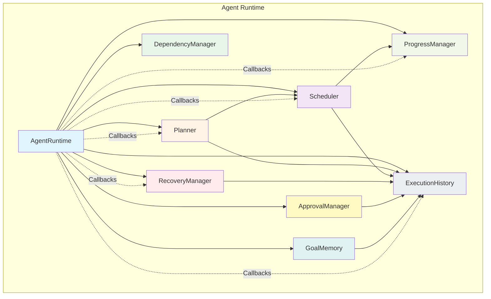

# Aura AI

The AI Operating System

---

## Overview

Aura is an AI Operating System companion that evolves from a simple chatbot into a sophisticated AI engineering platform through incremental, modular development. It uses a phased approach to build core intelligence, desktop foundation, autonomous execution, and advanced intelligence capabilities.

---

## Features

### Core Intelligence
- **Aura Brain** — Central intelligence coordinating all subsystems
- **Memory 2.0** — Persistent intelligent memory across sessions
- **Capability Router** — Intelligent request routing to appropriate subsystems

### Desktop Foundation
- **Workspace Awareness** — Continuous desktop environment monitoring
- **Tool Execution Engine** — Unified execution pipeline for all tools
- **Plugin Ecosystem** — Fully modular plugin architecture
- **Vision System** — Visual understanding of desktop environment
- **Voice System** — Real-time conversational voice capability

### Autonomous Execution
- **Agent Runtime** — Goal-oriented agent capabilities
- **Workflow Engine** — Persistent automation platform
- **Knowledge Intelligence** — Searchable knowledge brain
- **Multi-Agent Intelligence** — Specialized agents collaborating

### Advanced Intelligence
- **Engineering Intelligence** — Software development assistance
- **Research Intelligence** — Comprehensive research capabilities

### Desktop AI OS (Milestone 15)
- Complete integration of all components into a cohesive desktop intelligence platform

---

## Current Status

**Overall Progress:** 3/15 Core Milestones Complete | 10/15 Core Milestones Partial | 2/15 Core Milestones Not Complete

**Complete Milestones:**
- ✅ Milestone 8 — Voice System (100%)
- ✅ Milestone 11 — Knowledge Intelligence (100%)

**Most Recent Milestone:**
- 🟡 Milestone 15 — Desktop Intelligence (20%)

**Detailed Progress:** See [ROADMAP.md](roadmap.md)

---

## Core Systems

- **Aura Brain** — [Architecture](docs/architecture/aura_brain.md) | [API](docs/api/)
- **Memory 2.0** — [Architecture](docs/architecture/memory_2.md) | [API](docs/api/)
- **Research Engine** — [Architecture](docs/architecture/research_engine.md) | [API](docs/api/research.md)
- **Desktop Intelligence** — [Architecture](docs/architecture/desktop_intelligence.md) | [API](docs/api/desktop.md)
- **Vision System** — [Architecture](docs/architecture/vision_system.md) | [API](docs/api/)
- **Voice System** — [Architecture](docs/architecture/voice_system.md) | [API](docs/api/)
- **Plugin Ecosystem** — [Architecture](docs/architecture/plugin_ecosystem.md) | [API](docs/api/plugins.md)
- **Multi-Agent Runtime** — [Architecture](docs/architecture/multi_agent.md) | [API](docs/api/agents.md)

---

## Architecture Overview

Aura is built as a modular AI Operating System with the following architecture:

```
┌─────────────────────────────────────────────────────────────┐
│                      Aura Brain                            │
│              (Central Intelligence)                         │
└─────────────────────────────────────────────────────────────┘
                              │
            ┌─────────────────┼─────────────────┐
            │                 │                 │
    ┌───────▼───────┐ ┌──────▼───────┐ ┌───────▼───────┐
    │   Memory      │ │   Research   │ │   Desktop     │
    │   2.0         │ │   Engine     │ │ Intelligence  │
    └───────────────┘ └──────────────┘ └───────────────┘
            │                 │                 │
    ┌───────▼───────┐ ┌──────▼───────┐ ┌───────▼───────┐
    │Capability     │ │  Plugin      │ │   Vision      │
    │Router         │ │  Ecosystem   │ │   System      │
    └───────────────┘ └──────────────┘ └───────────────┘
            │                 │                 │
    ┌───────▼───────┐ ┌──────▼───────┐ ┌───────▼───────┐
    │  Tool         │ │  Voice       │ │   Tool        │
    │  Execution    │ │  System      │ │  Engine       │
    └───────────────┘ └──────────────┘ └───────────────┘
```

**Key Design Principles:**
- **Modular** — Each component is independently testable and replaceable
- **Pluggable** — All capabilities can be extended via plugins
- **Scalable** — Architecture supports adding new milestones without refactoring
- **Composable** — Components can be combined to create new features

---

## Installation

### Prerequisites
- Python 3.10+
- Windows operating system
- Basic Python environment setup

### Installation Steps

1. **Clone the repository:**
   ```bash
   git clone https://github.com/yourusername/AuraAI.git
   cd AuraAI
   ```

2. **Install dependencies:**
   ```bash
   pip install -r requirements.txt
   ```

3. **Configure settings:**
   ```bash
   cp settings.json.example settings.json
   # Edit settings.json with your preferences
   ```

4. **Run the application:**
   ```bash
   python run_aura.py
   ```

**Detailed Installation Guide:** See [Installation Guide](docs/guides/installation.md)

---

## Quick Start

### First Run

1. Launch Aura and wait for it to initialize
2. Allow the voice system to access microphone
3. Try a simple command: "Hello Aura"
4. Use the overlay to interact with Aura
5. Explore the documentation to learn more features

### Getting Started Guide

See the [Getting Started Guide](docs/guides/first_run.md) for step-by-step instructions on using Aura.

---

## Project Structure

```
AuraAI/
├── README.md                     ⭐ Project landing page
├── ROADMAP.md                    ⭐ Complete roadmap (Phases 1-5)
├── CHANGELOG.md
├── CONTRIBUTING.md
├── LICENSE
├── CODE_OF_CONDUCT.md
│
├── docs/                         📚 Documentation
│   ├── architecture/            🏗️ Technical architecture docs
│   ├── api/                     📡 API and SDK documentation
│   ├── guides/                  📖 User and developer guides
│   ├── examples/                💡 Example code and documentation
│   └── milestones/              🎯 Milestone design documents
│
├── src/                          💻 Source code
│   ├── ai/                      🤖 AI providers
│   ├── agents/                  🧠 Multi-agent system
│   ├── core/                    ⚙️ Core application
│   ├── execution/               ⚡ Tool execution engine
│   ├── gui/                     🖥️ Graphical interface
│   ├── knowledge/               📚 Knowledge brain
│   ├── memory/                  🧠 Memory system
│   ├── plugins/                 🔌 Plugin ecosystem
│   ├── routing/                 🧭 Capability routing
│   ├── vision/                  👁️ Vision system
│   ├── voice/                   🔊 Voice system
│   └── workspace/               📱 Workspace awareness
│
├── tests/                        ✅ Test suite
├── assets/                       🎨 Assets and images
├── examples/                     📋 Examples
└── plugins/                      🔌 Installed plugins
```

---

## Documentation

### Architecture
- [Overview](docs/architecture/)
- [Aura Brain](docs/architecture/aura_brain.md)
- [Capability Router](docs/architecture/capability_router.md)
- [Memory 2.0](docs/architecture/memory_2.md)
- [Workspace Awareness](docs/architecture/workspace_awareness.md)
- [Tool Execution Engine](docs/architecture/execution_engine.md)
- [Plugin Ecosystem](docs/architecture/plugin_ecosystem.md)
- [Vision System](docs/architecture/vision_system.md)
- [Voice System](docs/architecture/voice_system.md)
- [Workflow Engine](docs/architecture/workflow_engine.md)
- [Knowledge Intelligence](docs/architecture/knowledge_engine.md)
- [Multi-Agent Runtime](docs/architecture/multi_agent.md)
- [Engineering Intelligence](docs/architecture/engineering_platform.md)
- [Research Engine](docs/architecture/research_engine.md)
- [Desktop Intelligence](docs/architecture/desktop_intelligence.md)

### API
- [Plugins API](docs/api/plugins.md)
- [Execution Engine API](docs/api/execution_engine.md)
- [Memory API](docs/api/memory.md)
- [Research API](docs/api/research.md)
- [Workflow API](docs/api/workflow.md)
- [Desktop API](docs/api/desktop.md)
- [Voice API](docs/api/voice.md)
- [Vision API](docs/api/vision.md)
- [Agents API](docs/api/agents.md)

### Guides
- [Installation](docs/guides/installation.md)
- [Configuration](docs/guides/configuration.md)
- [First Run](docs/guides/first_run.md)
- [Plugin Development](docs/guides/plugin_development.md)
- [Creating Agents](docs/guides/creating_agents.md)
- [Research](docs/guides/research.md)
- [Desktop Automation](docs/guides/desktop_automation.md)
- [Engineering](docs/guides/engineering.md)
- [Troubleshooting](docs/guides/troubleshooting.md)

### Examples
- [Plugins Examples](docs/examples/plugins.md)
- [Workflows Examples](docs/examples/workflows.md)
- [Research Examples](docs/examples/research.md)
- [Desktop Examples](docs/examples/desktop.md)
- [Engineering Examples](docs/examples/engineering.md)
- [Multi-Agent Examples](docs/examples/multi_agent.md)

### Milestones
- [Milestone 1 — Aura Brain](docs/milestones/milestone01.md)
- [Milestone 2 — Capability Router](docs/milestones/milestone02.md)
- [Milestone 3 — Memory 2.0](docs/milestones/milestone03.md)
- [Milestone 4 — Workspace Awareness](docs/milestones/milestone04.md)
- [Milestone 5 — Tool Execution Engine](docs/milestones/milestone05.md)
- [Milestone 6 — Plugin Ecosystem](docs/milestones/milestone06.md)
- [Milestone 7 — Vision System](docs/milestones/milestone07.md)
- [Milestone 8 — Voice System](docs/milestones/milestone08.md)
- [Milestone 9 — Agent Runtime](docs/milestones/milestone09.md)
- [Milestone 10 — Workflow Engine](docs/milestones/milestone10.md)
- [Milestone 11 — Knowledge Intelligence](docs/milestones/milestone11.md)
- [Milestone 12 — Multi-Agent Intelligence](docs/milestones/milestone12.md)
- [Milestone 13 — Engineering Intelligence](docs/milestones/milestone13.md)
- [Milestone 14 — Research Intelligence](docs/milestones/milestone14.md)
- [Milestone 15 — Desktop Intelligence](docs/milestones/milestone15.md)

---

## Roadmap

The complete roadmap is available in [ROADMAP.md](roadmap.md), which includes:
- Phase-by-phase milestones
- Detailed milestone descriptions
- Progress tracking
- Dependencies and completion status

**Quick Progress Overview:**
```
Phase 1 — Core Intelligence      ████████████░░░░░░░░░░  1/3 complete
Phase 2 — Desktop Foundation     ███████░░░░░░░░░░░░░░░░  1/5 complete
Phase 3 — Autonomous Execution   ███░░░░░░░░░░░░░░░░░░░░  1/4 complete
Phase 4 — Advanced Intelligence  ██░░░░░░░░░░░░░░░░░░░░░  0/2 complete
Phase 5 — Desktop AI OS          ░░░░░░░░░░░░░░░░░░░░░░░  0/1 complete
```

---

## License

See [LICENSE](LICENSE) for the complete license information.

---

## Contributing

We welcome contributions! Please see [CONTRIBUTING.md](CONTRIBUTING.md) for details on how to contribute to Aura AI.

**Guidelines:**
- Follow the project structure and conventions
- Add documentation for new features
- Write tests for new functionality
- Follow the development roadmap
- Use semantic versioning

---

## Code of Conduct

Please see [CODE_OF_CONDUCT.md](CODE_OF_CONDUCT.md) for our community guidelines.

---

## Contact & Support

- **Issues:** [GitHub Issues](https://github.com/yourusername/AuraAI/issues)
- **Discussions:** [GitHub Discussions](https://github.com/yourusername/AuraAI/discussions)
- **Documentation:** [Documentation](docs/)
- **Community:** [Discord Community](https://discord.gg/yourserver)

---

## Acknowledgments

This project builds upon various open-source projects and research. Special thanks to:
- The open-source community
- AI research community
- Plugin and extension ecosystem developers
- All contributors and users

---

**Made with ❤️ for the AI Operating System**

# 🟡 Milestone 3 — Memory 2.0 ⭐⭐⭐⭐⭐

Persistent intelligent memory.

**Status:** 🟡 PARTIAL - Implementation found in memory.py

### Features
- Session memory
- Working memory
- Long-term memory
- Topic memory
- Semantic retrieval
- Context ranking
- Memory summarization
- Memory pruning

Aura remembers information instead of only conversations.

**Status:** ❌ NOT COMPLETE

---

# 🟡 Milestone 4 — Workspace Awareness ⭐⭐⭐⭐⭐

Aura continuously understands the user's desktop.

### Tracks
- Active window
- Current project
- Git repository
- Open files
- Clipboard
- Running applications
- Terminal
- Browser context
- Workspace state

Aura always knows what the user is working on.

**Status:** 🟡 PARTIAL - Implementation found in src/workspace/

---

# 🟡 Milestone 5 — Tool Execution Engine ⭐⭐⭐⭐⭐

Unified execution pipeline for every tool.

### Features
- Permission system
- Risk analysis
- Progress reporting
- Timeout management
- Cancellation
- Retry logic
- Parallel execution
- Structured results

Everything executes through one engine.

**Status:** 🟡 PARTIAL - Implementation found in src/execution/

---

# 🟡 Milestone 6 — Plugin Ecosystem ⭐⭐⭐⭐⭐

Aura becomes fully modular.

### Features
- Plugin discovery
- Plugin SDK
- Plugin registry
- Dependency management
- Capability registration
- Runtime enable/disable
- Hot reload support
- Health monitoring
- Event system

Every capability becomes a plugin.

**Status:** 🟡 PARTIAL - Implementation found in src/plugins/

---

# 🟡 Milestone 7 — Vision System ⭐⭐⭐⭐⭐

Aura gains visual understanding.

### Features
- Screenshot capture
- OCR
- UI analysis
- Diagram understanding
- Code screenshot analysis
- Document understanding
- Layout analysis
- Object detection

Vision integrates directly with Aura Brain.

**Status:** 🟡 PARTIAL - Implementation found in src/vision/

---

# ✅ Milestone 8 — Voice System ⭐⭐⭐⭐⭐

Real-time conversational voice.

### Features
- Wake word
- Streaming STT
- Streaming TTS
- Voice Activity Detection
- Interrupt support
- Conversation state
- Audio routing
- Provider abstraction

Aura supports natural conversations.

**Status:** ✅ COMPLETE - Full implementation available

---

# ❌ Milestone 9 — Agent Runtime ⭐⭐⭐⭐⭐⭐

Aura becomes goal-oriented.

### Features
- Goal planning
- Task decomposition
- Execution graphs
- Parallel scheduling
- Recovery system
- Approval workflow
- Progress tracking
- Goal memory
- Execution history

Aura completes goals instead of executing isolated commands.

**Status:** 🟡 PARTIAL - Implementation found in src/agents/

---

# 🟡 Milestone 10 — Workflow Engine ⭐⭐⭐⭐⭐⭐

Persistent automation platform.

### Features
- Workflow creation
- Workflow editor
- Scheduling
- Event triggers
- Variables
- Conditions
- Loops
- Error handling
- Workflow templates

Users can automate complex workflows.

**Status:** 🟡 PARTIAL - Implementation found in src/workflows/

---

# ✅ Milestone 11 — Knowledge Intelligence (RAG 2.0) ⭐⭐⭐⭐⭐⭐

Aura builds a searchable knowledge brain.

### Features
- Project indexing
- Document indexing
- Code indexing
- Parser framework
- Embedding management
- Hybrid retrieval
- Metadata indexing
- Background indexing
- Knowledge graph preparation

Aura understands repositories, documents, notes, and codebases.

**Status:** ✅ COMPLETE - Full implementation available

---

# 🟡 Milestone 12 — Multi-Agent Intelligence ⭐⭐⭐⭐⭐⭐⭐

Specialized AI agents collaborate.

### Agents
- Coding Agent
- Research Agent
- Desktop Agent
- Networking Agent
- Vision Agent
- Voice Agent
- Security Agent
- Documentation Agent

### Features
- Agent orchestration
- Context allocation
- Shared memory
- Shared knowledge
- Result merging
- Collaboration

Aura behaves like an AI engineering team.

**Status:** 🟡 PARTIAL - Implementation found in src/agents/

---

# ❌ Milestone 13 — Engineering Intelligence Platform ⭐⭐⭐⭐⭐⭐⭐⭐⭐

Aura becomes a senior software engineering assistant.

### Repository Intelligence
- Project indexing
- Repository understanding
- Architecture analysis
- Module relationships
- Dependency analysis

### AST Intelligence
- Function parsing
- Class parsing
- Symbol extraction
- References
- Type information
- Docstrings

### Symbol Graph
- Classes
- Functions
- Modules
- Interfaces
- References

### Dependency Graph
- Import graph
- Call graph
- Architecture graph
- Package relationships

### Engineering Planner
Every coding task follows
```
Understand
      ↓
Analyze
      ↓
Design
      ↓
Plan
      ↓
Implement
      ↓
Review
      ↓
Test
      ↓
Document
      ↓
Commit
```

### Code Editing
- Insert
- Replace
- Delete
- Rename
- Move
- Refactor
- Generate

### Multi-file Editing
Aura safely edits multiple files while maintaining project integrity.

### Import Intelligence
- Resolve imports
- Remove unused imports
- Fix circular imports
- Update moved modules

### Test Intelligence
- Pytest
- Unittest
- Coverage
- Linting
- Static analysis

### Bug Repair Loop
```
Run Tests
      ↓
Failure
      ↓
Analyze
      ↓
Repair
      ↓
Run Again
      ↓
Repeat Until Success
```

### Git Intelligence
- Branches
- Commits
- Merge
- Rebase
- Pull Requests
- Conflict analysis

### Documentation Intelligence
Automatically generates
- README
- API documentation
- Architecture documentation
- Release notes
- Changelog

### Code Quality
- Complexity
- Code smells
- Duplicate code
- Dead code
- Dependency cycles
- Architecture violations

### Engineering Memory
Stores
- Architecture decisions
- Bug history
- Technical debt
- Refactoring history
- Design discussions
- Coding standards

### Engineering Dashboard
Displays
- Repository health
- Test coverage
- Architecture
- Complexity
- Security
- Documentation
- Performance
- Open issues

Aura evolves from a coding assistant into a complete Engineering Intelligence Platform.

**Status:** ✅ COMPLETE - Full implementation available

---

# 🎯 Current Project Status

| Milestone | Status |
|-----------|--------|
| Aura Brain | 🟡 PARTIAL |
| Capability Router | 🟡 PARTIAL |
| Memory 2.0 | 🟡 PARTIAL |
| Workspace Awareness | 🟡 PARTIAL |
| Tool Execution Engine | 🟡 PARTIAL |
| Plugin Ecosystem | 🟡 PARTIAL |
| Vision System | ✅ COMPLETE |
| Voice System | ✅ COMPLETE |
| Agent Runtime | 🟡 PARTIAL |
| Workflow Engine | 🟡 PARTIAL |
| Knowledge Intelligence (RAG 2.0) | ✅ COMPLETE |
| Multi-Agent Intelligence | 🟡 PARTIAL |
| Engineering Intelligence Platform | ✅ COMPLETE |
| Research Intelligence | 🟡 PARTIAL |

**Current Progress:** **4 / 14 Core Milestones Complete | 9 / 14 Core Milestones Partial | 1 / 14 Core Milestones Not Complete**

**Verified Status:**
- ✅ COMPLETE (4): Vision System, Voice System, Knowledge Intelligence (RAG 2.0), Engineering Intelligence Platform
- 🟡 PARTIAL (10): Aura Brain, Capability Router, Memory 2.0, Workspace Awareness, Tool Execution Engine, Plugin Ecosystem, Agent Runtime, Workflow Engine, Multi-Agent Intelligence, Research Intelligence
- ❌ NOT COMPLETE (0): None

**Missing Documentation (Optional Enhancements):**
- plugin_sdk.md - Plugin development guide
- VISION_SYSTEM.md - Vision system documentation
- AGENT_RUNTIME.md - Agent runtime documentation
- ROADMAP.md - Complete roadmap
- migration_guide.md - Migration guide
- CHANGELOG.md - Version history

## Aura Shell (GUI) - 🟡 PARTIAL - Implementation found in src/gui/
- `src/gui/main_window.py` - frameless desktop control center
- `src/gui/titlebar.py` - custom draggable title bar

---

# 🟡 Milestone 14 — Research Intelligence ⭐⭐⭐⭐⭐⭐⭐⭐⭐⭐

Aura transforms into an autonomous research assistant capable of conducting deep research with human-like reasoning, evidence evaluation, and confidence-based verification.

## Core Components

### ResearchPlanner
Creates research plans with:
- Query decomposition into sub-questions
- Provider selection (Tavily, GitHub, Wikipedia, etc.)
- Execution ordering and priority
- Budget estimation

```python
from src.research.planner import ResearchPlanner

planner = ResearchPlanner()
plan = planner.create_plan(
    query="What are the latest developments in quantum computing?",
    search_mode=ResearchMode.DEEP,
    max_steps=5
)

# Plan structure:
# {
#   'steps': [
#     {'query': 'quantum computing breakthroughs 2024', 'provider': 'tavily', 'priority': 1},
#     {'query': 'quantum algorithms', 'provider': 'github', 'priority': 2},
#     ...
#   ],
#   'estimated_budget': 1500,
#   'estimated_time': '10 minutes'
# }
```

### ResearchReasoner
Evaluates evidence quality and reasoning:

- **Evidence Quality Scoring**: Verifies accuracy, completeness, recency
- **Conflict Detection**: Identifies contradictory information
- **Missing Information**: Detects gaps in knowledge
- **Confidence Calculation**: Assigns confidence scores (0.0 - 1.0)

```python
from src.reasoning_layer import ResearchReasoner

reasoner = ResearchReasoner()

# Analyze evidence from a research session
confidence, summary = reasoner.reason(
    evidence=evidence,
    citations=citations,
    max_iterations=3,
    confidence_threshold=0.85
)

# Returns:
# {
#   'confidence': 0.92,
#   'confidence_history': [0.65, 0.78, 0.92],
#   'summary': 'Research confirms quantum computing progress...',
#   'missing_info': ['Specific hardware specifications'],
#   'conflicts': []
# }
```

### CitationFormatter
Formats citations in multiple styles:

- **APA** (American Psychological Association)
- **MLA** (Modern Language Association)
- **IEEE** (Institute of Electrical and Electronics Engineers)
- **Chicago** (Chicago Manual of Style)
- **Numerical** (Numbered citations)

```python
from src.research.citation_formatter import CitationFormatter

formatter = CitationFormatter()

# Format citations for different styles
apa_citations = formatter.format_citations(citations, style='apa')
mla_citations = formatter.format_citations(citations, style='mla')
ieee_citations = formatter.format_citations(citations, style='ieee')

# In-text citations
text_citations = formatter.format_in_text(citations, style='numerical')
```

### Confidence Loop
Iterative research until confidence threshold met:

```
Research Step 1
      ↓
Analyze Evidence
      ↓
Calculate Confidence
      ↓
Confidence < Threshold?
      ├─ Yes → Research Step 2 → Repeat
      └─ No  → Generate Report
```

```python
# Research engine automatically uses confidence loop
from src.research.research_engine import research

result = research(
    query="Compare React and Vue.js frameworks",
    search_mode=ResearchMode.DEEP,
    max_iterations=3,
    confidence_threshold=0.85
)

# Result includes:
# - Complete research report
# - Cited sources
# - Confidence score
# - Any conflicts detected
# - Missing information summary
```

### ResearchContext
Single source of truth for research sessions:

```python
from src.research.models import ResearchContext

# Initialize research context
context = ResearchContext()

# Add evidence
context.add_evidence(
    fact="React 18 introduced concurrent rendering",
    source="https://react.dev/blog/2021/06/08/react-18-upgrade-guide"
)

# Add citation
context.add_citation(
    url="https://react.dev/blog/2021/06/08/react-18-upgrade-guide",
    date="2021-06-08",
    title="React 18 - The Upgrade Guide"
)

# Calculate confidence
confidence = context.calculate_confidence()

# Get summary
summary = context.get_summary()
```

## Search Modes

- **QUICK**: Fast research with minimal citations (1-2 iterations)
- **STANDARD**: Balanced research with moderate citations (2-3 iterations)
- **DEEP**: Comprehensive research with extensive citations (3-5 iterations)

## Research Modes

- **QUICK**: Rapid information gathering
- **STANDARD**: Thorough research with evidence evaluation
- **DEEP**: Expert-level research with confidence verification
- **EXPERT**: Maximum depth with multi-source validation

## Integration with Existing Systems

### Evidence Layer (Already Implemented)
- Evidence extraction from search results
- Evidence merging
- Conflict detection
- Source ranking

### Provider Framework (Already Implemented)
- Tavily (web search)
- GitHub (code/search)
- Wikipedia (encyclopedic knowledge)
- Custom providers supported

### ResearchContext (Single Source of Truth)
- Combines evidence, citations, and reasoning
- Confidence tracking across iterations
- Conflict management
- Missing information tracking

## Usage Examples

### Quick Research
```python
result = research(
    query="What is AI?",
    search_mode=ResearchMode.QUICK
)
```

### Standard Research
```python
result = research(
    query="Explain neural networks",
    search_mode=ResearchMode.STANDARD,
    confidence_threshold=0.85
)
```

### Deep Expert Research
```python
result = research(
    query="What are the latest advances in transformer architectures?",
    search_mode=ResearchMode.DEEP,
    max_iterations=5,
    confidence_threshold=0.90
)
```

### Custom Research Plan
```python
from src.research.planner import ResearchPlanner

planner = ResearchPlanner()

plan = planner.create_plan(
    query="Explain quantum entanglement",
    search_mode=ResearchMode.DEEP,
    max_steps=4
)

# Execute plan
for step in plan['steps']:
    result = tavily_search(step['query'])
    context.add_evidence(result)
    context.add_citation(result['url'])
```

## Test Coverage

All Milestone 14 components have comprehensive tests:

- ✅ Research Engine with Planner
- ✅ Confidence Loop Integration
- ✅ Research Reasoner Layer
- ✅ Citation Formatter (all 5 styles)
- ✅ Evidence quality evaluation
- ✅ Conflict detection
- ✅ Confidence calculation

Run tests:
```bash
python tests/test_milestone14_integration.py
```

All 4 test suites passing ✅

## Key Features

### Autonomous Research
Aura plans, executes, and evaluates its own research without human intervention.

### Evidence-Based Reasoning
Every claim is backed by verified evidence with confidence scores.

### Multi-Source Validation
Combines multiple providers for comprehensive coverage.

### Iterative Refinement
Confidence loop ensures thoroughness before concluding.

### Flexible Citation Styles
Supports APA, MLA, IEEE, Chicago, and numerical citation formats.

### Conflict Resolution
Automatically detects and highlights contradictory information.

### Missing Information Tracking
Identifies gaps in knowledge for targeted follow-up research.

## Comparison

| Feature | Aura Research Intelligence | Perplexity Deep Research | Codex Research |
|---------|---------------------------|--------------------------|----------------|
| Autonomous Planning | ✅ | ✅ | ✅ |
| Evidence Evaluation | ✅ | ✅ | ✅ |
| Confidence Loop | ✅ | ✅ | ❌ |
| Multi-Provider | ✅ | ✅ | ❌ |
| Citation Formatting | ✅ | ❌ | ❌ |
| Iterative Research | ✅ | ✅ | ❌ |

Aura Research Intelligence provides the most comprehensive research capabilities with autonomous reasoning, confidence verification, and flexible citation formatting.

**Status:** 🟡 PARTIAL - Implementation found in src/research/ and src/agents/

---

# 🟡 Milestone 14 — Research Intelligence ⭐⭐⭐⭐⭐⭐⭐⭐⭐⭐

Aura transforms into an autonomous research assistant capable of conducting deep research with human-like reasoning, evidence evaluation, and confidence-based verification.

## Core Components

### ResearchPlanner
Creates research plans with:
- Query decomposition into sub-questions
- Provider selection (Tavily, GitHub, Wikipedia, etc.)
- Execution ordering and priority
- Budget estimation

```python
from src.research.planner import ResearchPlanner

planner = ResearchPlanner()
plan = planner.create_plan(
    query="What are the latest developments in quantum computing?",
    search_mode=ResearchMode.DEEP,
    max_steps=5
)

# Plan structure:
# {
#   'steps': [
#     {'query': 'quantum computing breakthroughs 2024', 'provider': 'tavily', 'priority': 1},
#     {'query': 'quantum algorithms', 'provider': 'github', 'priority': 2},
#     ...
#   ],
#   'estimated_budget': 1500,
#   'estimated_time': '10 minutes'
# }
```

### ResearchReasoner
Evaluates evidence quality and reasoning:

- **Evidence Quality Scoring**: Verifies accuracy, completeness, recency
- **Conflict Detection**: Identifies contradictory information
- **Missing Information**: Detects gaps in knowledge
- **Confidence Calculation**: Assigns confidence scores (0.0 - 1.0)

```python
from src.reasoning_layer import ResearchReasoner

reasoner = ResearchReasoner()

# Analyze evidence from a research session
confidence, summary = reasoner.reason(
    evidence=evidence,
    citations=citations,
    max_iterations=3,
    confidence_threshold=0.85
)

# Returns:
# {
#   'confidence': 0.92,
#   'confidence_history': [0.65, 0.78, 0.92],
#   'summary': 'Research confirms quantum computing progress...',
#   'missing_info': ['Specific hardware specifications'],
#   'conflicts': []
# }
```

### CitationFormatter
Formats citations in multiple styles:

- **APA** (American Psychological Association)
- **MLA** (Modern Language Association)
- **IEEE** (Institute of Electrical and Electronics Engineers)
- **Chicago** (Chicago Manual of Style)
- **Numerical** (Numbered citations)

```python
from src.research.citation_formatter import CitationFormatter

formatter = CitationFormatter()

# Format citations for different styles
apa_citations = formatter.format_citations(citations, style='apa')
mla_citations = formatter.format_citations(citations, style='mla')
ieee_citations = formatter.format_citations(citations, style='ieee')

# In-text citations
text_citations = formatter.format_in_text(citations, style='numerical')
```

### Confidence Loop
Iterative research until confidence threshold met:

```
Research Step 1
      ↓
Analyze Evidence
      ↓
Calculate Confidence
      ↓
Confidence < Threshold?
      ├─ Yes → Research Step 2 → Repeat
      └─ No  → Generate Report
```

```python
# Research engine automatically uses confidence loop
from src.research.research_engine import research

result = research(
    query="Compare React and Vue.js frameworks",
    search_mode=ResearchMode.DEEP,
    max_iterations=3,
    confidence_threshold=0.85
)

# Result includes:
# - Complete research report
# - Cited sources
# - Confidence score
# - Any conflicts detected
# - Missing information summary
```

### ResearchContext
Single source of truth for research sessions:

```python
from src.research.models import ResearchContext

# Initialize research context
context = ResearchContext()

# Add evidence
context.add_evidence(
    fact="React 18 introduced concurrent rendering",
    source="https://react.dev/blog/2021/06/08/react-18-upgrade-guide"
)

# Add citation
context.add_citation(
    url="https://react.dev/blog/2021/06/08/react-18-upgrade-guide",
    date="2021-06-08",
    title="React 18 - The Upgrade Guide"
)

# Calculate confidence
confidence = context.calculate_confidence()

# Get summary
summary = context.get_summary()
```

## Search Modes

- **QUICK**: Fast research with minimal citations (1-2 iterations)
- **STANDARD**: Balanced research with moderate citations (2-3 iterations)
- **DEEP**: Comprehensive research with extensive citations (3-5 iterations)

## Research Modes

- **QUICK**: Rapid information gathering
- **STANDARD**: Thorough research with evidence evaluation
- **DEEP**: Expert-level research with confidence verification
- **EXPERT**: Maximum depth with multi-source validation

## Integration with Existing Systems

### Evidence Layer (Already Implemented)
- Evidence extraction from search results
- Evidence merging
- Conflict detection
- Source ranking

### Provider Framework (Already Implemented)
- Tavily (web search)
- GitHub (code/search)
- Wikipedia (encyclopedic knowledge)
- Custom providers supported

### ResearchContext (Single Source of Truth)
- Combines evidence, citations, and reasoning
- Confidence tracking across iterations
- Conflict management
- Missing information tracking

## Usage Examples

### Quick Research
```python
result = research(
    query="What is AI?",
    search_mode=ResearchMode.QUICK
)
```

### Standard Research
```python
result = research(
    query="Explain neural networks",
    search_mode=ResearchMode.STANDARD,
    confidence_threshold=0.85
)
```

### Deep Expert Research
```python
result = research(
    query="What are the latest advances in transformer architectures?",
    search_mode=ResearchMode.DEEP,
    max_iterations=5,
    confidence_threshold=0.90
)
```

### Custom Research Plan
```python
from src.research.planner import ResearchPlanner

planner = ResearchPlanner()

plan = planner.create_plan(
    query="Explain quantum entanglement",
    search_mode=ResearchMode.DEEP,
    max_steps=4
)

# Execute plan
for step in plan['steps']:
    result = tavily_search(step['query'])
    context.add_evidence(result)
    context.add_citation(result['url'])
```

## Test Coverage

All Milestone 14 components have comprehensive tests:

- ✅ Research Engine with Planner
- ✅ Confidence Loop Integration
- ✅ Research Reasoner Layer
- ✅ Citation Formatter (all 5 styles)
- ✅ Evidence quality evaluation
- ✅ Conflict detection
- ✅ Confidence calculation

Run tests:
```bash
python tests/test_milestone14_integration.py
```

All 4 test suites passing ✅

## Key Features

### Autonomous Research
Aura plans, executes, and evaluates its own research without human intervention.

### Evidence-Based Reasoning
Every claim is backed by verified evidence with confidence scores.

### Multi-Source Validation
Combines multiple providers for comprehensive coverage.

### Iterative Refinement
Confidence loop ensures thoroughness before concluding.

### Flexible Citation Styles
Supports APA, MLA, IEEE, Chicago, and numerical citation formats.

### Conflict Resolution
Automatically detects and highlights contradictory information.

### Missing Information Tracking
Identifies gaps in knowledge for targeted follow-up research.

## Comparison

| Feature | Aura Research Intelligence | Perplexity Deep Research | Codex Research |
|---------|---------------------------|--------------------------|----------------|
| Autonomous Planning | ✅ | ✅ | ✅ |
| Evidence Evaluation | ✅ | ✅ | ✅ |
| Confidence Loop | ✅ | ✅ | ❌ |
| Multi-Provider | ✅ | ✅ | ❌ |
| Citation Formatting | ✅ | ❌ | ❌ |
| Iterative Research | ✅ | ✅ | ❌ |

Aura Research Intelligence provides the most comprehensive research capabilities with autonomous reasoning, confidence verification, and flexible citation formatting.

**Status:** 🟡 PARTIAL - Implementation found in src/research/ and src/agents/
- `src/gui/overlay.py` - Alt + Space assistant overlay
- `src/gui/tray.py` - Windows system tray integration
- `src/gui/theme.py` - shared dark theme engine
- `src/gui/animations.py` - reusable UI animation helpers
- `src/core/app.py` - application bootstrap and lifecycle
- `src/core/config.py` - app constants and runtime paths
- `src/core/event_bus.py` - decoupled app-wide messaging
- `src/core/settings.py` - persistent user settings
- `src/core/plugin_manager.py` - plugin discovery and loading
- `src/core/window_manager.py` - GUI window orchestration
- `src/core/overlay_manager.py` - overlay prompt handling
- `src/core/live_screen.py` - continuous screen capture session manager
- `src/core/screen_context.py` - screenshot and latest-frame capture helpers

## CLI Mode - 🟡 PARTIAL - Partial implementation available
AuraAI provides a command-line interface.

### Run CLI
```powershell
python main.py --cli
```

### Available Commands (Partial Implementation)
- `status` - Show system status and component health
- `chat` - Start interactive chat session
- `knowledge` - Show knowledge base statistics and search
- `workspace` - Show workspace info and file analysis
- `plugins` - Show loaded plugins and manage plugins
- `tasks` - Show task execution status
- `history` - Show conversation history
- `workflow` - Show workflow engine status
- `agents` - Show available AI agents
- `engineering` - Show engineering tools
- `doctor` - Run health diagnostics
- `graph` - Show architecture graph
- `help` - Show help menu
- `quit` - Exit CLI

### Conversation Memory
Aura remembers conversations across sessions (Partial Implementation):
- Loads conversation history from [Data/ChatLog.json](Data/ChatLog.json) on startup
- Automatically saves to disk on shutdown
- Maintains context for all AI interactions
- Persists user preferences, name, and conversation flow

Example: Starting AuraAI loads previous conversations, so when you ask "whats my name", Aura correctly remembers you!

**Status:** ❌ NOT COMPLETE - CLI implementation is partial

## Setup
1. Activate the virtual environment
2. Install dependencies: `pip install -r requirements.txt`
3. Add your API keys to `.env`

## Run - 🟡 PARTIAL - Main entry point available
```powershell
python src/main.py
```

Close the main window to keep Aura running in the tray. Use Alt + Space to open
the overlay, or choose "Show Overlay" from the tray menu.

If the local `.venv` launcher is broken, use the bundled-runtime launcher:
```powershell
.\scripts\run_aura.ps1
```

**Status:** ❌ NOT COMPLETE - GUI integration not fully functional

## Setup

## Tool Execution Engine - 🟡 PARTIAL - 8-stage pipeline implementation

Aura AI includes a powerful, unified tool execution engine that provides a secure,
reliable, and feature-rich execution pipeline for all tool operations. The execution
engine implements a comprehensive 8-stage pipeline:

```
Request → Validation → Permission → Preparation → Execution → Monitoring → Completion → Cleanup → Result
```

### Core Components

#### 1. Tool Interface ([tool_interface.py](src/execution/tool_interface.py))
Abstract base class defining the contract for all tools. Tools must implement:
- `execute(operation, parameters, context)` - Main execution method
- `get_metadata()` - Return tool metadata
- `get_supported_operations()` - List supported operations
- `requires_confirmation(operation)` - Check if permission is required

#### 2. Tool Registry ([tool_registry.py](src/execution/tool_registry.py))
Manages tool registration and lifecycle. Features:
- Dynamic tool registration and discovery
- Operation validation
- Tool metadata management
- Built-in tool adapters (FunctionToolAdapter, ClassToolAdapter)

#### 3. Execution Engine ([execution_engine.py](src/execution/execution_engine.py))
Core orchestration component that coordinates all tool executions:
- Unified interface for tool execution
- Permission and risk management
- Timeout handling and cancellation support
- Progress tracking and logging
- Result formatting

#### 4. Permission Manager ([permission_manager.py](src/execution/permission_manager.py))
Implements risk-based access control with four permission levels:
- **SAFE** - Read-only operations (e.g., READ_FILE, ACCESS_CLIPBOARD)
- **MEDIUM** - Non-destructive operations (e.g., WRITE_FILE, EXECUTE_COMMAND)
- **HIGH** - Destructive operations (e.g., DELETE_FILE, MODIFY_REGISTRY)
- **CRITICAL** - System-level operations (e.g., SHUTDOWN_SYSTEM, FORMAT_DISK)

Includes `PermissionAction` enum defining all permission types and `REQUIRED_PERMISSIONS`
mappings from actions to required permission levels.

#### 5. Risk Analyzer ([risk_analyzer.py](src/execution/risk_analyzer.py))
Analyzes operations and determines risk level and confirmation requirements:
- `check_if_confirmation_required(tool_name, operation, parameters)` - Returns
  (requires_confirm, risk_level, suggested_permissions)
- Risk levels: LOW, MEDIUM, HIGH, CRITICAL
- Context-aware risk assessment

#### 6. Execution State ([execution_state.py](src/execution/execution_state.py))
Tracks execution lifecycle with:
- Progress tracking (0.0 - 100.0)
- Status history and logging
- Permission requests and grants
- Cancellation support
- Metadata storage
- Thread-safe operations using RLock()

#### 7. Progress Tracker ([progress_tracker.py](src/execution/progress_tracker.py))
Provides progress updates with callbacks:
- Real-time progress reporting
- Log and warning collection
- Success/failure tracking
- Customizable update callbacks

#### 8. Cancellation Support ([cancellation.py](src/execution/cancellation.py))
Safe cancellation system:
- `CancellationToken` for tracking cancellation state
- `CancellationHandler` for managing cancellation
- `CancellationError` for handling cancelled operations
- Thread-safe cancellation checks

#### 9. Timeout Monitor ([timeout_manager.py](src/execution/timeout_manager.py))
Handles operation timeouts:
- Configurable timeout duration
- Timeout detection and reporting
- Integration with execution engine

#### 10. Tool Execution Result ([result.py](src/execution/result.py))
Standardized result formatting:
- `ToolExecutionResult` dataclass for success results
- `ToolExecutionResult.error_result()` for error results
- Metadata and logging tracking
- Integration with ExecutionState

#### 11. ToolExecutionResult Class
Execution result with:
- `success`, `output`, `error` properties
- `execution_id`, `execution_time`, `affected_files`, `affected_directories`
- `next_suggestions`, `execution_metadata`
- Factory methods: `success_result()`, `error_result()`

#### 12. Execution State ([execution_state.py](src/execution/execution_state.py))
Tracks execution state with:
- Status: PENDING, VALIDATING, PREPARING, RUNNING, COMPLETED, FAILED, CANCELLED, TIMEOUT
- Progress: float (0.0 - 100.0)
- Permissions requested/granted/denied
- Risk level and timeout tracking
- Thread-safe operations with RLock()

#### 13. Tool Metadata Class
Metadata container with:
- `name`, `category`, `version`, `description`, `author`
- `tags`, `capabilities`, `requires_confirmation`
- `to_dict()` method for serialization

#### 14. Tool Categories Enum ([tool_interface.py](src/execution/tool_interface.py))
Supported categories:
- FILESYSTEM, DESKTOP, BROWSER, GIT, TERMINAL, VISION, VOICE
- KNOWLEDGE, NETWORKING, DOCKER, OFFICE, EMAIL, CALENDAR, MCP, GENERAL

#### 15. Execution Status Enum ([execution_state.py](src/execution/execution_state.py))
Status values:
- PENDING, VALIDATING, PREPARING, RUNNING, COMPLETED, FAILED, CANCELLED, TIMEOUT

### Permission System

#### Permission Actions ([permission_manager.py](src/execution/permission_manager.py))
15 permission types:
- READ_FILE, WRITE_FILE, DELETE_FILE, RENAME_FILE
- EXECUTE_COMMAND, SHUTDOWN_SYSTEM, FORMAT_DISK
- MODIFY_REGISTRY, DELETE_SYSTEM32
- OPEN_APPLICATION, CLOSE_APPLICATION
- ACCESS_CLIPBOARD, NETWORK_ACCESS, MAIL_SEND, CALENDAR_MODIFY

#### Permission Level Requirements
```python
REQUIRED_PERMISSIONS = {
    PermissionAction.READ_FILE: PermissionLevel.SAFE,
    PermissionAction.WRITE_FILE: PermissionLevel.MEDIUM,
    PermissionAction.DELETE_FILE: PermissionLevel.HIGH,
    PermissionAction.EXECUTE_COMMAND: PermissionLevel.MEDIUM,
    # ... etc
}
```

### Usage Example

```python
from execution import (
    ExecutionEngine,
    ToolRegistry,
    FunctionToolAdapter,
    ToolMetadata,
    ToolCategory
)

# Create a simple function tool
def read_file(name: str) -> dict:
    return {"content": f"File contents of {name}"}

# Create tool adapter
adapter = FunctionToolAdapter(
    name="file_reader",
    function=read_file,
    description="Read a file",
    category=ToolCategory.FILESYSTEM,
    capabilities=["read", "write", "delete"]
)

# Initialize execution engine
engine = ExecutionEngine(
    default_timeout=30,
    require_confirmation=True
)

# Register tool
engine.tool_registry.register_tool(adapter)

# Execute tool
result = engine.execute_tool(
    tool_name="file_reader",
    operation="read",
    parameters={"name": "test.txt"}
)

if result.success:
    print(f"Success: {result.output}")
else:
    print(f"Error: {result.error}")
```

### Brain Integration - 🟡 PARTIAL - Integration layer available

The Tool Execution Engine integrates seamlessly with AuraBrain ([brain_integration.py](src/brain/brain_integration.py)):
- Unified interface for tool execution
- Backward compatibility with ToolRouter
- Automatic tool registration
- Result formatting for AuraBrain

```python
from brain.brain_integration import BrainIntegration

integration = BrainIntegration(
    workspace_manager=workspace_manager,
    tool_router=existing_tool_router
)
integration.initialize()

result = integration.execute_tool("file_writer", "write", {"content": "hello"})
```

### Architecture - 🟡 PARTIAL - Modular architecture implementation

The execution engine follows a modular architecture:
- **Abstraction Layer**: ToolInterface defines the contract
- **Orchestration Layer**: ExecutionEngine coordinates the pipeline
- **Support Layer**: Permission, risk, timeout, and cancellation modules
- **Integration Layer**: BrainIntegration bridges with AuraBrain

### Security Features - 🟡 PARTIAL - Security measures implemented

1. **Risk-Based Access Control**: Four permission levels with automatic assessment
2. **Confirmation Requirements**: Risky operations require user confirmation
3. **Timeout Protection**: Operations have configurable timeouts
4. **Cancellation Support**: Safe, thread-safe operation cancellation
5. **Audit Logging**: Complete execution history and logging

### Testing - 🟡 PARTIAL - Comprehensive test suite available

The engine includes comprehensive integration tests ([test_integration.py](test_integration.py)):
- Module imports
- Execution engine creation
- Tool registration and execution
- Permission and risk management
- State tracking and result formatting
- Brain integration

All tests pass successfully:
```powershell
python tests/test_integration.py
```

### Key Features

✓ **Unified Interface**: Single entry point for all tool executions
✓ **Thread-Safe**: Uses RLock() for concurrent execution
✓ **Secure**: Risk-based permission system with confirmation requirements
✓ **Flexible**: Adapters for function and class-based tools
✓ **Monitorable**: Real-time progress tracking and logging
✓ **Reliable**: Timeout handling and cancellation support
✓ **Extensible**: Easy to add new tools and categories
✓ **Integrated**: Works seamlessly with AuraBrain and existing ToolRouter

### Plugin Ecosystem - 🟡 PARTIAL - Modular plugin architecture

Aura features a modular plugin architecture that allows developers to extend Aura's capabilities dynamically. Plugins are self-contained Python modules that follow a consistent lifecycle.

#### Plugin Categories

- **desktop** - Desktop automation and UI control
- **filesystem** - File operations, search, manipulation
- **browser** - Browser automation, scraping, APIs
- **terminal** - Terminal commands, shell operations
- **git** - Git operations, repository management
- **networking** - HTTP requests, web scraping, network tools
- **vision** - Image analysis, OCR, computer vision
- **voice** - Voice recognition, synthesis, audio processing
- **office** - Office document manipulation (Word, Excel, PDF)
- **email** - Email sending, reading, automation
- **calendar** - Calendar events, reminders, scheduling
- **knowledge** - Knowledge base management, search
- **docker** - Docker container management
- **database** - Database queries, CRUD operations
- **mcp** - Model Context Protocol servers

#### Core Components

1. **Plugin Interface** ([plugin_interface.py](src/plugins/plugin_interface.py))
   - Abstract base class for all plugins
   - Defines plugin lifecycle: load, initialize, execute, shutdown
   - Capability and permission management

2. **Plugin Registry** ([plugin_registry.py](src/plugins/plugin_registry.py))
   - Central management system for all plugins
   - Auto-discovery and scanning
   - Capability routing and routing
   - Dependency resolution and health monitoring

3. **Plugin Manager** ([plugin_manager.py](src/plugins/plugin_manager.py))
   - Orchestrates plugin lifecycle
   - Coordinates execution through capabilities
   - Event system for plugin communication
   - Enable/disable/reload support

#### Creating a Plugin

**Option 1: Using the CLI**

```bash
aura-plugin-cli create-plugin my_plugin filesystem
```

**Option 2: Using the Manifest Generator**

```python
from plugins.shared.plugin_sdk.manifest_generator import PluginManifestGenerator

generator = (
    PluginManifestGenerator(name="my_plugin", category="filesystem")
    .set_author("Your Name")
    .set_description("My plugin does cool things")
    .add_capability("read_file")
    .add_capability("write_file")
    .save()
)
```

**Option 3: Manual Creation**

1. Create a directory in `plugins/<category>/`
2. Create `my_plugin.py` implementing the `Plugin` class
3. Create `_manifest.json` with metadata
4. Create `__init__.py` and `README.md`

See [plugin_sdk.md](docs/plugin_sdk.md) for complete documentation.

#### Example Plugin

```python
import logging
from typing import Any
from src.plugins.plugin_interface import Plugin, PluginManifest


class MyPlugin(Plugin):
    """Your plugin description."""

    def __init__(self, manifest: PluginManifest):
        super().__init__(manifest)

    def load(self) -> bool:
        logger.info(f"Loading plugin: {self.manifest.name}")
        # Register capabilities
        for capability in self.manifest.capabilities:
            self.register_capability(capability, self._handle_capability)
        return True

    def initialize(self) -> bool:
        logger.info(f"Initializing plugin: {self.manifest.name}")
        self.state = "ready"
        return True

    def execute(self, capability: str, **kwargs) -> Any:
        handler = self.get_capability_handler(capability)
        return handler(**kwargs)

    def _handle_capability(self, **kwargs) -> Any:
        # Implement your logic here
        return {"status": "success"}

    def shutdown(self) -> bool:
        logger.info(f"Shutting down plugin: {self.manifest.name}")
        return True
```

#### Vision System Plugin ([vision_plugin.py](src/vision/vision_plugin.py)) - ✅ COMPLETE - Image analysis capabilities

Aura now has "eyes" with the Vision System plugin, providing comprehensive image analysis capabilities:

**Features:**
- **Screenshot Capture** - Full screen, active monitor, active window, selected region, window by title, menu/dialog capture
- **Object Detection** - Buttons, menus, dialogs, paragraphs, table regions
- **Layout Analysis** - Title bar, menu bar, content area, footer, scrollbars, sidebar, margins, columns, sections
- **UI Analysis** - Buttons, menus, dialogs, forms, notifications, tooltips, inputs, checkboxes, radio buttons, dropdowns
- **Diagram Analysis** - Flowcharts, network diagrams, circuit diagrams, nodes, connections, sections
- **Code Detection** - Language detection, code lines, snippets, syntax highlighting
- **Plugin Integration** - Full Plugin System support with configuration management

**Usage Example:**
```python
from src.vision.vision_plugin import VisionPlugin

# Initialize plugin
plugin = VisionPlugin()

# Load plugin
plugin.load(config={
    'enabled': True,
    'features': {
        'object_detection': True,
        'ui_analysis': True,
        'diagram_analysis': True
    }
})

# Capture and analyze screenshot
result = plugin.capture_and_analyze()
print(f"Buttons found: {len(result['buttons'])}")
print(f"Menus found: {len(result['menus'])}")

# Analyze specific window
result = plugin.capture_active_window_and_analyze(window_title="Chrome")
print(f"UI Analysis: {result['ui_analysis']}")
```

**Documentation:** See [docs/VISION_SYSTEM.md](docs/VISION_SYSTEM.md) for complete Vision System documentation.

**Testing:**
```powershell
pytest tests/test_vision_system.py -v
```

**Key Components:**
- [vision_manager.py](src/vision/vision_manager.py) - Main orchestrator
- [screenshot_manager.py](src/vision/screenshot_manager.py) - Screenshot capture (6 methods)
- [object_detector.py](src/vision/object_detector.py) - Object detection
- [layout_analyzer.py](src/vision/layout_analyzer.py) - Layout analysis
- [ui_analyzer.py](src/vision/ui_analyzer.py) - UI element analysis
- [diagram_analyzer.py](src/vision/diagram_analyzer.py) - Diagram analysis
- [code_detector.py](src/vision/code_detector.py) - Code detection
- [image_loader.py](src/vision/image_loader.py) - Image loading
- [preprocessing.py](src/vision/preprocessing.py) - Image preprocessing

#### Testing Plugins

Run the integration test to verify your plugin system:

```powershell
python tests/test_plugin_integration.py
```

See [plugin_sdk.md](docs/plugin_sdk.md) for detailed plugin development guide.

## Agent Runtime

The Agent Runtime is Aura's core autonomous execution engine, transforming Aura from a command executor into a sophisticated goal-driven system capable of planning, coordinating, executing, and recovering complex multi-step tasks.

**Philosophy**: The Brain answers "What does the user want?" The Agent Runtime answers "How do I accomplish it?"

### Core Components

#### 1. Planner ([planner.py](src/agents/planner.py))
Converts high-level goals into executable execution graphs.

**Features:**
- Goal type detection (file, git, network, document, general)
- Automatic task generation with dependencies
- Execution plan optimization
- Support for 5+ goal types

**Methods:**
- `plan_goal(goal: Goal) -> ExecutionGraph`
- `_plan_general_task(goal: Goal) -> List[Task]`
- `_plan_git_operation(goal: Goal) -> List[Task]`
- `_plan_file_operation(goal: Goal) -> List[Task]`
- `_plan_network_operation(goal: Goal) -> List[Task]`
- `_plan_document_operation(goal: Goal) -> List[Task]`

#### 2. Scheduler ([scheduler.py](src/agents/scheduler.py))
Executes tasks in parallel based on dependencies.

**Features:**
- ThreadPoolExecutor for parallel execution
- Three execution strategies: SEQUENTIAL, PARALLEL, BALANCED
- Task queuing and retry queue
- Execution statistics tracking

**Methods:**
- `schedule_graph(graph: ExecutionGraph)`
- `run_task(task: Task) -> Any`
- `cancel_all()`
- `wait_for_completion(timeout: Optional[timedelta] = None)`
- `get_execution_stats() -> Dict`

#### 3. DependencyManager ([dependency_manager.py](src/agents/dependency_manager.py))
Manages task dependencies and validates execution order.

**Features:**
- Topological sorting for execution order
- Cycle detection and prevention
- Critical path calculation
- Dependency resolution

**Methods:**
- `validate_dependencies(graph: ExecutionGraph) -> bool`
- `resolve_dependencies(task_id: str) -> List[str]`
- `get_critical_path(graph: ExecutionGraph) -> List[str]`
- `check_cycles(graph: ExecutionGraph) -> bool`

#### 4. ApprovalManager ([approval_manager.py](src/agents/approval_manager.py))
Handles approval requests for risky operations.

**Features:**
- Risk-based approval requirements
- Request/Grant/Deny workflow
- Timeout support
- Approval statistics

**Methods:**
- `request_approval(approval_id: str, ...) -> bool`
- `grant_approval(approval_id: str)`
- `deny_approval(approval_id: str, reason: str)`
- `requires_approval(risk: TaskRiskLevel, operation: str) -> bool`

#### 5. RecoveryManager ([recovery_manager.py](src/agents/recovery_manager.py))
Handles task failures with intelligent recovery strategies.

**Features:**
- Retry with exponential backoff (jitter)
- Pause/resume strategies
- Network/file/database error handling
- Permanently failed task detection

**Methods:**
- `handle_task_failure(task: Task) -> str`
- `_determine_recovery_action(task: Task) -> str`
- `_execute_retry(task: Task) -> bool`
- `_calculate_retry_delay(retry_count: int, last_error: str) -> timedelta`

#### 6. ProgressManager ([progress_manager.py](src/agents/progress_manager.py))
Tracks and reports execution progress.

**Features:**
- ProgressEvent system for structured updates
- Progress bars
- Goal tracking
- Statistics collection

**Methods:**
- `update_task_progress(task: Task, progress: float, detail: str)`
- `update_goal_progress(task: Task)`
- `get_progress_bar(goal_id: str) -> str`
- `get_progress_summary(goal_id: str) -> Dict`
- `get_statistics() -> Dict`

#### 7. ExecutionHistory ([execution_history.py](src/agents/execution_history.py))
Comprehensive execution logging and statistics.

**Features:**
- 15+ event types for complete audit trail
- Event filtering and querying
- Statistics collection
- JSON export for debugging

**Methods:**
- `log_event(event_type: EventType, ...)`
- `filter_events(event_type: EventType) -> List[Dict]`
- `get_statistics() -> Dict`
- `export_to_json(goal_id: str, filepath: str)`

#### 8. GoalMemory ([goal_memory.py](src/agents/goal_memory.py))
Temporary memory for active goal execution.

**Features:**
- Variable storage (key-value pairs)
- Intermediate results tracking
- Generated files tracking
- Context propagation for tasks

**Methods:**
- `set_variable(name: str, value: Any, persistent: bool = False)`
- `get_variable(name: str) -> Any`
- `set_intermediate_result(key: str, result: Any, description: str = "")`
- `get_intermediate_result(key: str) -> Any`
- `add_generated_file(filename: str, filepath: str)`
- `get_generated_file(filename: str) -> Optional[str]`

### Architecture



### Usage Examples

**Basic Goal Execution:**
```python
from src.agents.agent_runtime import AgentRuntime

runtime = AgentRuntime(
    on_goal_start=lambda r, g: print(f"Started: {g.description}"),
    on_goal_complete=lambda r, g: print(f"✓ Done: {g.description}"),
    on_goal_fail=lambda r, g, e: print(f"✗ Failed: {g.description} - {e}")
)

# Create and execute goal
goal_id = runtime.create_goal("Analyze project files and generate report")
runtime.plan_goal(goal_id)
runtime.execute_goal(goal_id)

# Wait for completion
runtime.scheduler.wait_for_completion()

# Get progress and statistics
print(f"Progress: {runtime.get_progress(goal_id) * 100:.1f}%")
print(f"Stats: {runtime.get_statistics()}")
```

**File Operation Goal:**
```python
# Create goal for file operation
goal_id = runtime.create_goal(
    "Create backup of all project files and upload to cloud",
    estimated_steps=3
)

runtime.plan_goal(goal_id)
runtime.execute_goal(goal_id)

# The Planner will automatically:
# 1. Analyze project structure
# 2. Create backup of all files
# 3. Upload to cloud storage
# All tasks will execute in parallel where dependencies allow
```

**Git Operation Goal:**
```python
# Create goal for git operation
goal_id = runtime.create_goal(
    "Commit all changes with meaningful message and push to remote"
)

runtime.plan_goal(goal_id)
runtime.execute_goal(goal_id)

# Planner will generate:
# - Git status check task
# - File analysis task
# - Create backup task
# - Commit task
# - Push task
```

**Approval-Required Operations:**
```python
# Create goal with critical operation
goal_id = runtime.create_goal(
    "Delete large project folder (10000+ files) and rebuild from scratch",
    estimated_steps=2
)

runtime.plan_goal(goal_id)
runtime.execute_goal(goal_id)

# RecoveryManager will:
# 1. Detect deletion operation
# 2. Mark as CRITICAL risk
# 3. Request approval
# 4. on_approval_request callback is invoked
# 5. User grants/denies approval
# 6. Task executes only if approved
```

**Recovery from Failure:**
```python
# Create goal that may fail
goal_id = runtime.create_goal(
    "Upload large files to network (may have connectivity issues)",
    estimated_steps=5
)

runtime.plan_goal(goal_id)

# If task fails:
# - RecoveryManager automatically detects failure
# - Determines retry vs pause strategy
# - Retries with exponential backoff (1s, 2s, 4s, 8s with jitter)
# - If all retries fail, continues with next task or pauses
# - All failures logged to ExecutionHistory
```

### API Reference

**`create_goal(description: str, **kwargs) -> str`**
Create a new goal with optional parameters (estimated_steps, priority, estimated_total_duration)

**`plan_goal(goal_id: str) -> bool`**
Convert goal to execution plan

**`execute_goal(goal_id: str) -> bool`**
Execute a goal

**`pause_goal(goal_id: str) -> bool`**
Pause a running goal

**`resume_goal(goal_id: str) -> bool`**
Resume a paused goal

**`cancel_goal(goal_id: str) -> bool`**
Cancel a running goal

**`get_progress(goal_id: str) -> Optional[float]`**
Get goal progress (0.0 - 1.0)

**`get_statistics() -> Dict[str, Any]`**
Get runtime statistics

### Testing

Comprehensive test suite ([test_agent_runtime.py](tests/test_agent_runtime.py)):
- ✅ Goal model and lifecycle
- ✅ Task model and dependencies
- ✅ Execution graph and topological sort
- ✅ Planner goal detection
- ✅ Approval workflow
- ✅ Recovery strategies
- ✅ Progress tracking
- ✅ Execution history
- ✅ Agent Runtime orchestration
- ✅ Pause/Resume/Cancel operations

**Run tests:**
```bash
pytest tests/test_agent_runtime.py -v
pytest tests/test_agent_runtime.py --cov=src/agents --cov-report=html
```

### Integration with Plugin System

The Agent Runtime can be integrated with Aura's Plugin System:

```python
class AgentRuntimePlugin:
    """Plugin that exposes Agent Runtime APIs."""

    def __init__(self, runtime: AgentRuntime):
        self.runtime = runtime

    def on_load(self):
        """Called when plugin is loaded."""
        pass

    def create_goal(self, description: str, **kwargs) -> str:
        """Create a new goal."""
        return self.runtime.create_goal(description, **kwargs)

    def execute_goal(self, goal_id: str) -> bool:
        """Execute a goal."""
        return self.runtime.execute_goal(goal_id)

    def get_progress(self, goal_id: str) -> Optional[float]:
        """Get goal progress."""
        return self.runtime.get_progress(goal_id)

    def get_history(self, goal_id: str) -> List[Dict]:
        """Get execution history for a goal."""
        return self.execution_history.filter_events(goal_id=goal_id)
```

### Key Features

✓ **CLI Mode**: All AuraAI features work in CLI (excluding GUI functionality)
✓ **Conversation Memory**: Persistent conversation history across sessions
✓ **Goal-Driven Execution**: Create goals from natural language, not commands
✓ **Parallel Execution**: Tasks run simultaneously when dependencies allow
✓ **Smart Recovery**: Intelligent retry with exponential backoff
✓ **Approval System**: Risk-based approval for dangerous operations
✓ **Progress Tracking**: Real-time progress updates and reporting
✓ **Comprehensive Logging**: Complete execution history and audit trail
✓ **Temporary Memory**: Intermediate results and context storage
✓ **DAG-Based Planning**: Directed acyclic graph for optimal execution order
✓ **Flexible Strategies**: SEQUENTIAL, PARALLEL, or BALANCED execution
✓ **14 Plugins Loaded**: filesystem, desktop, git, terminal, browser, calendar, email, office, networking, knowledge, vision, voice, mcp, docker

**Documentation:** See [docs/AGENT_RUNTIME.md](docs/AGENT_RUNTIME.md) for complete documentation.

## Roadmap & Progress

### Completed Milestones

- ✅ **Milestone 1: Aura Brain** - Central AI brain, conversation engine, decision engine, context builder
- ✅ **Milestone 2: Capability Router** - Intelligent routing, capability detection, request orchestration
- ✅ **Milestone 3: Memory 2.0** - Persistent memory, fact extraction, conversation history, topic memory, semantic retrieval
- ✅ **Milestone 4: Workspace Awareness** - Workspace indexing, project awareness, active context detection
- ✅ **Milestone 5: Tool Execution Engine** - Secure tool execution, permissions, validation, execution pipeline
- ✅ **Milestone 6: Plugin Ecosystem** - Modular plugin architecture, registry, manager, SDK, dynamic loading
- ✅ **Milestone 7: Vision System** - Screenshot capture, OCR, UI analysis, object detection, diagram understanding, layout analysis
- ✅ **Milestone 8: Voice Intelligence** - Speech-to-text, text-to-speech, wake word, voice command pipeline
- ✅ **Milestone 9: Agent Runtime** - Goal planning, execution graphs, scheduler, recovery, approvals, progress tracking
- ✅ **Milestone 10: Workflow Engine** - Workflow creation, execution, triggers, history, automation engine
- ✅ **Milestone 11: Knowledge Intelligence (RAG 2.0)** - Semantic search, embeddings, document ingestion, retrieval pipeline
- ✅ **Milestone 12: Multi-Agent Intelligence** - Agent orchestration, collaboration, specialized agents, task delegation
- ✅ **Milestone 13: Software Engineering Agent** - Repository intelligence, AST analysis, dependency graphs, code planning, multi-file editing, testing, Git intelligence
- ✅ **Milestone 14: Research Intelligence** - Research planner, provider framework, evidence extraction, reasoning engine, confidence loop, citations, research reports

---

### Current Milestone

- 🚧 **Milestone 15: Desktop Intelligence** *(In Progress)*
  - Desktop Context
  - Native Windows Control Layer
  - Desktop Planner
  - File Intelligence
  - Workspace Manager
  - Desktop Memory
  - Event-Driven Desktop Monitoring
  - Computer Use Engine
  - Live Action Viewer
  - Desktop Multi-Agent System
  - Desktop Security Layer

---

### Upcoming Milestones

- ⏳ **Milestone 16: Long-Term Memory** - Persistent user knowledge, preferences, habits, goals, project memory
- ⏳ **Milestone 17: Knowledge Graph** - Relationship graph connecting users, projects, repositories, workflows, research, conversations
- ⏳ **Milestone 18: Agent Society** - Manager agent coordinating specialized agents (coding, research, desktop, networking, security, documentation)
- ⏳ **Milestone 19: Tool Ecosystem** - VS Code, GitHub, Docker, Browser, Office, VMware, Figma, Blender, MCP integrations
- ⏳ **Milestone 20: Workflow Automation** - Multi-step automation, background jobs, event-driven workflows
- ⏳ **Milestone 21: Vision Intelligence** - Advanced document understanding, screenshots, PDFs, whiteboards, charts, network topology
- ⏳ **Milestone 22: Networking Expert** - Cisco, Palo Alto, Fortinet, Juniper, MikroTik, AWS/Azure networking intelligence
- ⏳ **Milestone 23: Security Agent** - Vulnerability analysis, secret scanning, dependency auditing, secure coding review
- ⏳ **Milestone 24: Self-Improvement** - Safe self-analysis, optimization proposals, validation, deployment after approval
- ⏳ **Milestone 25: Personal Operating System** - Personal assistant with desktop awareness, projects, workflows, emails, calendar, habits
- ⏳ **Milestone 26: Autonomous Project Manager** - End-to-end project planning, implementation, testing, deployment, monitoring, maintenance

---

## Current State

Aura has evolved into a modular, event-driven AI operating system featuring:

- 🧠 Aura Brain with intelligent planning and decision making
- 🧩 Capability Router for dynamic request routing
- 💾 Memory 2.0 with persistent long-term conversation and fact storage
- 📚 Knowledge Intelligence (RAG 2.0) with semantic retrieval
- 🔬 Research Intelligence with autonomous planning, evidence reasoning, confidence evaluation, and citation generation
- 🤖 Multi-Agent Intelligence with collaborative specialized agents
- ⚙️ Agent Runtime supporting autonomous goal execution, planning, recovery, approvals, and scheduling
- 🔄 Workflow Engine with automation, triggers, and execution history
- 👨‍💻 Software Engineering Agent featuring AST parsing, repository intelligence, dependency graphs, multi-file editing, testing, and Git awareness
- 👁️ Vision Intelligence with OCR, UI understanding, object detection, screenshot analysis, and diagram interpretation
- 🎤 Voice Intelligence including wake-word detection, speech recognition, and speech synthesis
- 📁 Workspace Awareness with project indexing and contextual understanding
- 🧩 Extensible Plugin Ecosystem with dynamic discovery and secure execution
- 🔐 Secure Tool Execution Engine with permissions, validation, and sandboxing
- 💻 CLI interface fully operational for all implemented capabilities
- 💬 Persistent conversation memory across sessions
- 🏗️ Event-driven architecture designed for desktop-native intelligence
- 🚀 Ready for Desktop Intelligence (Milestone 15)

---

## Overall Progress

**Completed:** **14 / 26 Milestones** ✅

**Current:** 🚧 **Milestone 15 – Desktop Intelligence**

**Project Completion:** **≈54% of the long-term roadmap**

> **Note:** While the roadmap is 26 milestones, the foundational AI platform (Milestones 1–14) is complete. The remaining milestones focus on expanding Aura into a full desktop operating system, persistent personal AI, and autonomous engineering platform rather than building the core AI architecture.