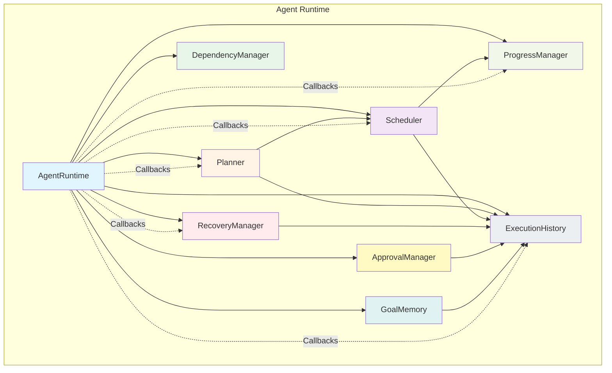

# Agent Runtime

## Overview

The Agent Runtime is Aura's core autonomous execution engine. It transforms Aura from a simple command executor into a sophisticated goal-driven system capable of planning, coordinating, executing, and recovering complex multi-step tasks.

**Philosophy**: The Brain answers "What does the user want?" The Agent Runtime answers "How do I accomplish it?"

## Architecture



## Components

### 1. Planner (`planner.py`)
Converts high-level goals into executable execution graphs.

**Methods**:
- `plan_goal(goal: Goal) -> ExecutionGraph`
- `_plan_general_task(goal: Goal) -> List[Task]`
- `_plan_git_operation(goal: Goal) -> List[Task]`
- `_plan_file_operation(goal: Goal) -> List[Task]`
- `_plan_network_operation(goal: Goal) -> List[Task]`
- `_plan_document_operation(goal: Goal) -> List[Task]`

### 2. Scheduler (`scheduler.py`)
Executes tasks in parallel based on dependencies.

**Execution Strategies**:
- `SEQUENTIAL`: Execute tasks one at a time
- `PARALLEL`: Execute all ready tasks simultaneously
- `BALANCED`: Mix of sequential and parallel execution

**Methods**:
- `schedule_graph(graph: ExecutionGraph)`
- `run_task(task: Task) -> Any`
- `cancel_all()`
- `wait_for_completion(timeout: Optional[timedelta] = None)`
- `get_execution_stats() -> Dict`

### 3. DependencyManager (`dependency_manager.py`)
Manages task dependencies and validates execution order.

**Methods**:
- `validate_dependencies(graph: ExecutionGraph) -> bool`
- `resolve_dependencies(task_id: str) -> List[str]`
- `get_critical_path(graph: ExecutionGraph) -> List[str]`
- `check_cycles(graph: ExecutionGraph) -> bool`

### 4. ApprovalManager (`approval_manager.py`)
Handles approval requests for risky operations.

**Approval Workflow**:
1. Task with `approval_required: ApprovalRequired.YES` is created
2. Manager requests approval
3. Callback receives request (user grants/denies)
4. Task executes only if approved

**Methods**:
- `request_approval(approval_id: str, task_id: str, ...) -> bool`
- `grant_approval(approval_id: str)`
- `deny_approval(approval_id: str, reason: str)`
- `requires_approval(risk: TaskRiskLevel, operation: str) -> bool`

### 5. RecoveryManager (`recovery_manager.py`)
Handles task failures with intelligent recovery strategies.

**Recovery Strategies**:
- `RETRY`: Retry with exponential backoff (jitter)
- `CONTINUE`: Skip task, continue with next
- `PAUSE`: Pause goal execution
- `FAIL`: Mark task permanently failed

**Methods**:
- `handle_task_failure(task: Task) -> str`
- `_determine_recovery_action(task: Task) -> str`
- `_execute_retry(task: Task) -> bool`
- `_calculate_retry_delay(retry_count: int, last_error: str) -> timedelta`

### 6. ProgressManager (`progress_manager.py`)
Tracks and reports execution progress.

**Progress Events**:
- `ProgressEvent(task_id, goal_id, progress, detail, timestamp)`

**Methods**:
- `update_task_progress(task: Task, progress: float, detail: str)`
- `update_goal_progress(task: Task)`
- `get_progress_bar(goal_id: str) -> str`
- `get_progress_summary(goal_id: str) -> Dict`
- `get_statistics() -> Dict`

### 7. ExecutionHistory (`execution_history.py`)
Comprehensive execution logging and statistics.

**Event Types**:
- `GOAL_CREATED`, `GOAL_STARTED`, `GOAL_COMPLETED`, `GOAL_FAILED`, `GOAL_CANCELLED`
- `GOAL_PAUSED`, `GOAL_RESUMED`
- `TASK_CREATED`, `TASK_STARTED`, `TASK_COMPLETED`, `TASK_FAILED`
- `PROGRESS_UPDATE`, `RECOVERY_APPLIED`, `APPROVAL_REQUESTED`, `APPROVAL_GRANTED`, `APPROVAL_DENIED`

**Methods**:
- `log_event(event_type: EventType, ...)`
- `filter_events(event_type: EventType) -> List[Dict]`
- `get_statistics() -> Dict`
- `export_to_json(goal_id: str, filepath: str)`
- `get_statistics() -> Dict`

### 8. GoalMemory (`goal_memory.py`)
Temporary memory for active goal execution.

**Features**:
- Variable storage (key-value pairs)
- Intermediate results tracking
- Generated files tracking
- Context propagation for tasks

**Methods**:
- `set_variable(name: str, value: Any, persistent: bool = False)`
- `get_variable(name: str) -> Any`
- `set_intermediate_result(key: str, result: Any, description: str = "")`
- `get_intermediate_result(key: str) -> Any`
- `add_generated_file(filename: str, filepath: str)`
- `get_generated_file(filename: str) -> Optional[str]`
- `export_to_dict() -> Dict`

## Usage Examples

### Basic Goal Execution

```python
from src.agents.agent_runtime import AgentRuntime

# Create runtime
runtime = AgentRuntime(
    on_goal_start=lambda r, g: print(f"Goal started: {g.description[:50]}..."),
    on_goal_complete=lambda r, g: print(f"Goal completed: {g.description[:50]}..."),
    on_goal_fail=lambda r, g, e: print(f"Goal failed: {g.description[:50]}... - {e}")
)

# Create a goal
goal_id = runtime.create_goal("Analyze project files and generate report")

# Plan the goal (convert to execution graph)
runtime.plan_goal(goal_id)

# Execute the goal
runtime.execute_goal(goal_id)

# Wait for completion (in non-async code)
runtime.scheduler.wait_for_completion()

# Get results
print(f"Goal progress: {runtime.get_progress(goal_id) * 100:.1f}%")
print(f"Statistics: {runtime.get_statistics()}")
```

### File Operation Goal

```python
# Create goal for file operation
goal_id = runtime.create_goal(
    "Create backup of all project files and upload to cloud",
    estimated_steps=3
)

# Plan and execute
runtime.plan_goal(goal_id)
runtime.execute_goal(goal_id)

# The Planner will automatically:
# 1. Analyze project structure
# 2. Create backup of all files
# 3. Upload to cloud storage
# All tasks will execute in parallel where dependencies allow
```

### Git Operation Goal

```python
# Create goal for git operation
goal_id = runtime.create_goal(
    "Commit all changes with meaningful message and push to remote"
)

runtime.plan_goal(goal_id)
runtime.execute_goal(goal_id)

# Planner will generate:
# - Git status check task
# - File analysis task
# - Create backup task
# - Commit task
# - Push task
```

### Approval-Required Operations

```python
# Create goal with critical operation
goal_id = runtime.create_goal(
    "Delete large project folder (10000+ files) and rebuild from scratch",
    estimated_steps=2
)

runtime.plan_goal(goal_id)
runtime.execute_goal(goal_id)

# RecoveryManager will:
# 1. Detect deletion operation
# 2. Mark as CRITICAL risk
# 3. RecoveryManager requests approval
# 4. on_approval_request callback is invoked
# 5. User grants/denies approval
# 6. Task executes only if approved
```

### Recovery from Failure

```python
# Create goal that may fail
goal_id = runtime.create_goal(
    "Upload large files to network (may have connectivity issues)",
    estimated_steps=5
)

runtime.plan_goal(goal_id)

# If task fails:
# - RecoveryManager automatically detects failure
# - Determines retry vs pause strategy
# - Retries with exponential backoff (1s, 2s, 4s, 8s with jitter)
# - If all retries fail, continues with next task or pauses
# - All failures logged to ExecutionHistory
```

### Progress Monitoring

```python
# Execute goal with progress callbacks
runtime = AgentRuntime(
    on_goal_start=lambda r, g: print(f"Started: {g.description}"),
    on_goal_complete=lambda r, g: print(f"✓ Completed: {g.description}"),
    on_goal_fail=lambda r, g, e: print(f"✗ Failed: {g.description} - {e}")
)

goal_id = runtime.create_goal("Process large dataset and generate insights")

runtime.plan_goal(goal_id)

# Monitor progress in real-time
while runtime.is_running:
    progress = runtime.get_progress(goal_id)
    print(f"Progress: {progress * 100:.1f}%")
    time.sleep(1)
```

## API Reference

### AgentRuntime

#### Constructor

```python
AgentRuntime(
    on_goal_start: Optional[Callable[['AgentRuntime', Goal], None]] = None,
    on_goal_complete: Optional[Callable[['AgentRuntime', Goal], None]] = None,
    on_goal_fail: Optional[Callable[['AgentRuntime', Goal, str], None]] = None,
    on_agent_ready: Optional[Callable[['AgentRuntime'], None]] = None
) -> AgentRuntime
```

#### Core Methods

**`create_goal(description: str, **kwargs) -> str`**
- Create a new goal
- Args: description, estimated_steps, priority, estimated_total_duration
- Returns: goal_id

**`plan_goal(goal_id: str) -> bool`**
- Convert goal to execution plan
- Args: goal_id
- Returns: success

**`execute_goal(goal_id: str) -> bool`**
- Execute a goal
- Args: goal_id
- Returns: success

**`pause_goal(goal_id: str) -> bool`**
- Pause a running goal
- Args: goal_id
- Returns: success

**`resume_goal(goal_id: str) -> bool`**
- Resume a paused goal
- Args: goal_id
- Returns: success

**`cancel_goal(goal_id: str) -> bool`**
- Cancel a running goal
- Args: goal_id
- Returns: success

**`get_progress(goal_id: str) -> Optional[float]`**
- Get goal progress (0.0 - 1.0)
- Args: goal_id
- Returns: progress or None

**`get_statistics() -> Dict[str, Any]`**
- Get runtime statistics
- Returns: dictionary with all statistics

## Configuration Guide

### Task Priority

```python
from src.agents.models import TaskPriority

# Low priority: Background tasks
task = Task("Index files", priority=TaskPriority.LOW)

# Normal priority: Standard operations
task = Task("Process data", priority=TaskPriority.NORMAL)

# High priority: Important operations
task = Task("Generate report", priority=TaskPriority.HIGH)

# Critical: Must complete, blocks everything else
task = Task("Save database", priority=TaskPriority.CRITICAL)
```

### Task Risk Level

```python
from src.agents.models import TaskRiskLevel

# Low risk: Safe operations (read, search)
task = Task("Read file", risk_level=TaskRiskLevel.LOW)

# Medium risk: Moderate operations (copy, modify)
task = Task("Update configuration", risk_level=TaskRiskLevel.MEDIUM)

# High risk: Dangerous operations (delete, overwrite)
task = Task("Delete directory", risk_level=TaskRiskLevel.HIGH)

# Critical: Extremely dangerous (format, destroy)
task = Task("Format disk", risk_level=TaskRiskLevel.CRITICAL)
```

### Retry Policy

```python
from src.agents.models import RetryPolicy

# No retry on failure
task = Task("Simple operation", retry_policy=RetryPolicy.NO_RETRY)

# Default retry with exponential backoff
task = Task("Network operation", retry_policy=RetryPolicy.DEFAULT)

# Retry with backoff, up to 3 times
task = Task("Upload file", retry_policy=RetryPolicy.RETRY_WITH_BACKOFF, max_retries=3)

# Retry forever until success
task = Task("Critical operation", retry_policy=RetryPolicy.RETRY_FOREVER)
```

### Approval Requirements

```python
from src.agents.models import ApprovalRequired

# Always requires approval for CRITICAL operations
task = Task(
    "Delete all logs",
    approval_required=ApprovalRequired.YES,
    risk_level=TaskRiskLevel.CRITICAL
)

# Check approval requirement
if task.approval_required == ApprovalRequired.YES:
    # Request approval before executing
    approved = manager.request_approval(...)
    if not approved:
        # Don't execute
        pass
```

## Test Scenarios

See `tests/test_agent_runtime.py` for comprehensive test coverage including:

1. ✅ Goal creation and lifecycle
2. ✅ Task dependency management
3. ✅ Parallel execution groups
4. ✅ Topological sorting
5. ✅ Cycle detection
6. ✅ Planner goal detection
7. ✅ Approval workflow
8. ✅ Recovery strategies
9. ✅ Progress tracking
10. ✅ Execution history logging
11. ✅ Agent Runtime orchestration
12. ✅ Pause/Resume/Cancel operations
13. ✅ Statistics reporting

### Running Tests

```bash
# Run all tests
pytest tests/test_agent_runtime.py -v

# Run specific test class
pytest tests/test_agent_runtime.py::TestTaskModel -v

# Run specific test method
pytest tests/test_agent_runtime.py::TestTaskModel::test_task_creation -v

# Run with coverage
pytest tests/test_agent_runtime.py --cov=src/agents --cov-report=html
```

## Integration with Plugin System

The Agent Runtime can be integrated with Aura's Plugin System:

```python
class AgentRuntimePlugin:
    """Plugin that exposes Agent Runtime APIs."""

    def __init__(self, runtime: AgentRuntime):
        self.runtime = runtime

    def on_load(self):
        """Called when plugin is loaded."""
        pass

    def on_unload(self):
        """Called when plugin is unloaded."""
        pass

    def create_goal(self, description: str, **kwargs) -> str:
        """Create a new goal."""
        return self.runtime.create_goal(description, **kwargs)

    def execute_goal(self, goal_id: str) -> bool:
        """Execute a goal."""
        return self.runtime.execute_goal(goal_id)

    def get_progress(self, goal_id: str) -> Optional[float]:
        """Get goal progress."""
        return self.runtime.get_progress(goal_id)

    def get_history(self, goal_id: str) -> List[Dict]:
        """Get execution history for a goal."""
        return self.execution_history.filter_events(goal_id=goal_id)
```

## Performance Considerations

1. **ThreadPool vs Multiprocessing**: Uses ThreadPoolExecutor for better performance on I/O-bound tasks
2. **Dependency Resolution**: O(V+E) complexity using Kahn's algorithm
3. **Topological Sort**: O(V+E) complexity for execution order
4. **Memory Usage**: GoalMemory stores intermediate results in memory
5. **Parallelism**: Max parallel tasks limited by CPU cores

## Troubleshooting

### Goal not executing
- Check if `plan_goal()` succeeded
- Verify `execute_goal()` was called
- Check for Python exceptions in execution

### Tasks not running in parallel
- Verify dependencies are correctly set
- Check `ExecutionStrategy` setting
- Ensure tasks are ready (no unmet dependencies)

### Task failing repeatedly
- Check retry policy configuration
- Review error messages in ExecutionHistory
- Verify network/file/database connectivity

### Approval not requested
- Check `TaskRiskLevel` is high enough
- Verify `ApprovalRequired.YES` is set
- Check `ApprovalManager.on_approval_request` callback

### Progress not updating
- Verify `ProgressManager` callbacks are set
- Check task completion status
- Ensure `update_goal_progress()` is called after task completion

## Future Enhancements

1. **Persistent Memory**: Save goal progress and intermediate results to disk
2. **Task Prioritization**: Dynamic task prioritization during execution
3. **Goal Decomposition**: Automatic recursive goal decomposition
4. **Skill Integration**: Integrate with Aura's skill system for complex operations
5. **Multi-Agent Coordination**: Support for agent-to-agent goal delegation
6. **Smart Retry**: Intelligent retry based on error type and task type
7. **Caching**: Cache intermediate results to avoid recomputation

## Summary

The Agent Runtime provides Aura with the ability to:
- ✅ Create goals from natural language
- ✅ Plan goals into execution graphs
- ✅ Execute tasks in parallel when dependencies allow
- ✅ Handle failures with intelligent recovery
- ✅ Request approvals for critical operations
- ✅ Track and report progress
- ✅ Log all events for debugging and analytics
- ✅ Store intermediate results in temporary memory

This enables Aura to transform from a command executor to an autonomous goal-driven system capable of handling complex, multi-step tasks with minimal human intervention.
