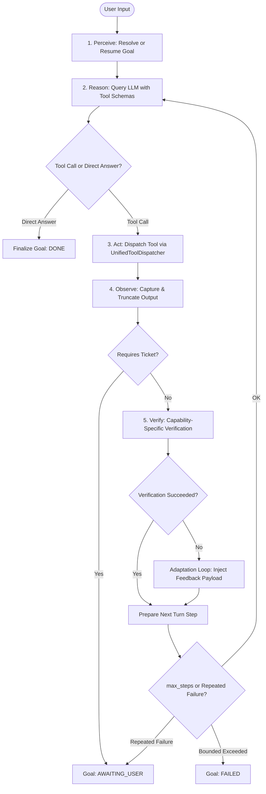
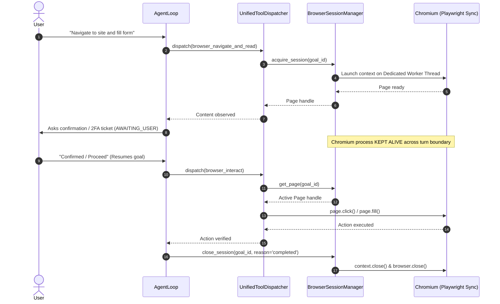

# AuraAI Agent Loop Architecture & Operational Hardening Reference

## Executive Summary

This document serves as the permanent engineering reference and retrospective for the six-phase architectural transition of **AuraAI**. AuraAI transitioned from brittle keyword/regex pre-classifiers to an active, bounded **Perceive -> Reason -> Act -> Observe -> Verify** execution engine (`AgentLoop`).

### Core Architectural Shift
Historically, user queries in AuraAI traversed layers of regex pattern matching and keyword heuristics (e.g., words like *analyze*, *explain*, *market*, *run* triggered hardcoded 90-second Playwright crawls or brittle desktop scripts). 

The upgraded architecture establishes a crisp, deterministic separation:
1. **Deterministic Fast-Paths (< 25ms, 0 Tokens)**: Hardware telemetry, device toggles, system settings, security tickets, and local utility commands resolve immediately in local runtime without LLM latency or cost.
2. **Cognitive & Action Delegation (`AgentLoop`)**: Complex instructions, multi-step problem solving, coding, terminal operations, browser research, and file mutations delegate to `AgentLoop`. The model dynamically inspects available tools, plans steps, receives tool outputs, verifies results, and self-corrects via closed-loop feedback.

---

## 1. System Architecture & Component Design

### A. The Active Agent Loop (`src/core/orchestration/agent_loop.py`)
`AgentLoop` implements a turn-by-turn state machine adhering to five phases:



#### Loop Guardrails
1. **Bounded Execution**: Bounded by `max_steps` (default 8). If an agent exhausts its step ceiling without achieving resolution, the goal is marked `FAILED` and a structured attempt history is surfaced to the user.
2. **Repeated Failure Guard**: Halts immediately with status `AWAITING_USER` if two consecutive steps fail with the exact same `(tool_name, tool_args)` tuple, preventing infinite token-wasting loops.
3. **Adaptation Feedback Loop**: When capability verification fails, a structured payload (`status: failed_verification`, error reason, guidance) is injected into the next turn's observation. This allows the model to alter its arguments or strategy rather than repeating errors.
4. **Session Boundary Invariant**: `AgentSession` is constructed once per `run()` invocation at the goal level rather than per step, ensuring `session.data` persists across steps. `AgentSession` is strictly isolated from `MasterOrchestrator._last_session`.

---

### B. Pluggable Capability Verification (`VERIFIER_REGISTRY`)
Every tool execution passes through capability-specific verification before being accepted:

| Tool | Verifier Strategy | Falsifiable Verification Criteria | Failure Behavior |
| :--- | :--- | :--- | :--- |
| `create_file_artifact` | Disk-State | File exists on disk, is a regular file, and `stat().st_size > 0`. | Rejects 0-byte or missing files; injects failure reason into adaptation loop. |
| `browser_navigate_and_read` | Content-State | Playwright call succeeded, content non-empty, and substantive text extracted (>= 15 chars or page title). | Rejects empty/whitespace pages; triggers model retry. |
| `browser_interact` | Live Context & Action Match | Live page handle exists in `BrowserSessionManager`, selector/action matches requested arguments, tombstone checked. | Fails closed if session missing/evicted; rejects mismatched argument echoes. |
| `terminal_run_command` | Exit Code & Error Stream | Process `returncode == 0` and scans stderr/stdout for fatal patterns (`SyntaxError:`, `Traceback`, `fatal:`, `permission denied`). | Marks step failed on non-zero exit or syntax crashes. |
| `edit_file` | AST Syntax Validation | For Python files (`.py`), runs `ast.parse()` on updated file on disk. | Rejects syntax errors (e.g., unclosed parens) and feeds exact line error to model. |
| *Default fallback* | Status Validation | Validates `status != "error"`. | Marks step failed if dispatcher returned error payload. |

---

### C. Persistent Browser Session Continuity (`src/browser/browser_session_manager.py`)
Browser automation in desktop agent loops requires surviving asynchronous human-in-the-loop pauses without dangling Chromium processes or race conditions.



#### Key Subsystem Invariants
1. **Desktop Concurrency Cap**: Exactly 1 active persistent browser context allowed globally. If a new goal requests a browser session while an old one is idle, the old session is gracefully evicted with tombstone `bumped_by_new_goal`.
2. **Dedicated Thread Pinning**: Playwright Sync API is thread-affine. All browser operations (`acquire`, `active_page`, `close`) are scheduled onto a dedicated thread pool (`_BROWSER_EXECUTOR` on `AuraDedicatedBrowserThread`). Operations scheduled from asyncio use `run_on_browser_thread_async` without blocking the main event loop.
3. **In-Flight Lease Protection (`operation_scope`)**: Prevents eviction while an active navigation or interaction is currently in progress. Concurrent requests receive an actionable `busy: True` response rather than crashing.
4. **Eviction Tombstones**: Clear distinction between `bumped_by_new_goal`, `ttl_expired` (15-minute inactivity in `AWAITING_USER`), and `never_established`.
5. **Daemon Sweeper Integration**: `TriggerScheduler` periodically scans and reaps orphaned sessions exceeding idle TTL.

---

### D. Intent Routing & Heuristic Pruning (Phase 4 & Phase 5)
- **Centralized Feature Flag**: `is_agent_loop_enabled() -> bool` (defined in `src/core/orchestration/agent_loop.py`). Defaults to `True` (`"1"`). Opt-out via `"0"`, `"false"`, `"no"`.
- **Heuristic Pruning & Interactive Preservation in `IntentRouter`**:
  - Passive informational queries ("go to ... and read", "search google for ...") bypass into `AgentLoop` via `provider_chat`.
  - Multi-step interactive e-commerce and web automation goals ("add to cart", "checkout", "buy", "order", "book flight", "fill form") route directly to `autonomous_browser`.
  - `_detect_shell_command`: Returns `None` under `is_agent_loop_enabled()`.
  - `_asks_for_desktop_action`: Returns `False` under `is_agent_loop_enabled()`.
  - `ResearchDecision.analyze`: Returns `(False, "Delegated to AgentLoop", SearchMode.STANDARD)`.
- **Deterministic Fast-Path Allowlist (`AuraCore.DETERMINISTIC_LOCAL_INTENTS`)**:
  34 canonical intents are evaluated via `conv_engine._answer_local_intent()`:
  ```python
  DETERMINISTIC_LOCAL_INTENTS: frozenset[str] = frozenset({
      "local_time", "live_weather", "battery_status",
      "bluetooth_status", "bluetooth_control",
      "wifi_status", "wifi_control",
      "network_status", "system_status",
      "confirm_ticket", "voice_control", "restart_aura",
      "memory_summary", "remember_fact", "profile_lookup",
      "skills_lookup", "goals_lookup", "preferences_lookup", "projects_lookup",
      "brightness_control", "audio_control",
      "task_complete", "tasks.complete", "reminders_query",
      "play_music", "smarthome_control", "folder_creation",
      "hud_overlay", "overlay_toggle", "say_phrase",
      "open_file", "rag_query", "resume_browser", "capability_status",
      "autonomous_browser",
  })
  ```
  Cognitive queries, terminal operations, and file edits bypass `_answer_local_intent()` and fall through directly into `AgentLoop`.

### E. Unified Architecture & Single Source of Truth
- All client interfaces (**CLI one-shot `main.py`**, **Interactive CLI `clients/cli_client.py`**, **PySide6 GUI `clients/gui_client.py`**, **Spotlight Chat `run_chat_window.py`**, and **Voice Notch `run_voice_notch.py` / `ContinuousVoiceLoop`**) funnel directly into `AuraCore.process_request()` and `AuraCore.process_request_stream()`.
- **Autonomous Browser Engine Engine Configuration**:
  - Default Model: `gemini-3.5-flash` via `google.genai` SDK (`GeminiTurnRunner`).
  - Auto-Escalation Guardrail: If an LLM run reaches \(\ge 5,000\) tokens, it automatically escalates from Groq to Gemini 3.5 Flash to prevent Groq 8k TPM rate-limiting.
  - Headless configuration: Controlled by `AURA_BROWSER_HEADLESS=false` in `.env`.


---

## 2. Engineering Post-Mortems & Real-World Failure Modes

### Post-Mortem 1: Lexical Scope Poisoning & The Mocking Trap
- **Symptom**: During live verification of `folder_creation` (unmocked execution), the fast-path crashed with:
  `UnboundLocalError: cannot access local variable 'Path' where it is not associated with a value`
- **Root Cause**: Python resolves variable scoping statically at compile/parse time for each function. If an assignment or import of a symbol occurs anywhere in a function body, Python marks that symbol as local to the entire function. In `conversation_engine.py` (a 1,900+ line module), `_answer_local_intent()` contained inner imports (e.g. `from pathlib import Path`, `import re`, `import subprocess`) inside later branches (e.g. lines 1787, 1810). This statically shadowed module-level imports, causing earlier branches referencing `Path.home()` (line 1483 for `folder_creation`, line 1515 for `desktop_action`) to fail immediately when reached.
- **The Mocking Trap**: Every prior unit test for `folder_creation` had patched `_answer_local_intent`'s return value (`with patch.object(engine, "_answer_local_intent", return_value=...):`). As a result, the test suite passed with 100% green status while the actual production branch was fatal and unusable.
- **Blast Radius**: A complete AST audit revealed 6 branches in `_answer_local_intent` and 4 other methods in `conversation_engine.py` (`__init__`, `process`, `_lookup_web`, `_gather_screen_perception`) with identical shadowing vulnerabilities.
- **Permanent Solution**:
  1. Removed all inner shadowing imports across `conversation_engine.py`.
  2. Implemented `test_unmocked_local_intent_execution` to run actual function bodies against representative inputs.
  3. Implemented a **Universal Static AST Guard** (`test_no_shadowed_module_imports_in_conversation_engine`) in `tests/unit/test_phase4_intent_pruning.py`. It dynamically extracts all 31 module-level imports and verifies across every function that no inner import (`ast.Import`, `ast.ImportFrom`), store assignment (`ast.Store`), or argument declaration (`ast.arg`) shadows any module-level import.

### Post-Mortem 2: Simulated Success in Tool Dispatch
- **Symptom**: `_exec_browser_interact` previously returned `{"status": "success", "message": "Browser interaction simulated: ..."}` when no active browser session existed.
- **Impact**: The model believed clicks and keystrokes had succeeded when nothing had happened on the user's screen.
- **Solution**: Enforced strict fail-closed invariants across all tool executors. If the required resource is absent, tools must return `status: "error"` with actionable diagnostics.

### Post-Mortem 3: Thread-Affinity of Sync Playwright in Asyncio
- **Symptom**: Calling `session.close()` or `session.active_page()` from `asyncio.to_thread` or the main thread resulted in Playwright runtime exceptions: `Error: It looks like you are using Playwright Sync API inside the asyncio loop`.
- **Solution**: Thread pinning. All Playwright interactions are strictly funneled through `AuraDedicatedBrowserThread` via `run_on_browser_thread` and `run_on_browser_thread_async`.

---

## 3. Operational Evidence & Verification Baseline

All operational claims are backed by live execution with real dependencies (Groq API, Playwright Chromium, psutil, Windows OS):

| Scenario | Input Query | Subsystem Exercised | Observed Latency | Observed Result / Invariant |
| :--- | :--- | :--- | :--- | :--- |
| **Deterministic Fast-Path** | `"what time is it"` | Local intent handler | **25.29ms** | Evaluated via `_answer_local_intent()`. Zero tokens. `GoalStore` recorded fast-path step. |
| **Pure Reasoning** | `"Explain quicksort in exactly one sentence."` | `AgentLoop` direct reasoning | **0.82s** | Bypassed Playwright crawl. Groq generated 1-step direct response. Single write to `GoalStore`. |
| **Unprompted Tool Selection** | `"How is my computer running right now? Check current system performance."` | `AgentLoop` autonomous planning | **2.07s** | Model autonomously selected `system_get_telemetry()`. Retrieved live CPU (35.1%), RAM (68.6%). Summarized output. |
| **Live Browser Execution** | `"Navigate to https://example.com and tell me the page title."` | Chromium + `BrowserSessionManager` | **4.82s** | Default-on flag active. Launched Chromium on dedicated thread, extracted title, verified >= 15 chars, clean teardown. |
| **Unmocked Local Utility** | `"create folder named aura_verify_ff4bc905 in workspace"` | Unmocked `_answer_local_intent` | **< 30ms** | Created real folder on disk via `Path.home()`. No `UnboundLocalError`. Cleaned up post-run. |
| **Smart Home Hardware** | `"turn on living room light"` | Tapo Smart Bulb API (`_answer_local_intent`) | **905.62ms** | Unmocked live execution reached Tapo bulb at `192.168.29.2`, returned `💡 Smart Bulb turned ON (Brightness: 1%)`. Network-bound IoT roundtrip. |

### Regression Suite Status
```powershell
.\.venv\Scripts\pytest tests/unit/test_phase4_intent_pruning.py tests/unit/test_agent_loop.py tests/unit/test_browser_session_manager.py tests/unit/test_phase3_verifiers.py tests/core/tools/test_unified_tool_dispatcher.py -v
```
- **Total**: **55 passed in 76.21s (100% green, 0 failures, 0 regressions)**.

---

## 4. Forward Tracking Priorities

1. **Phase 5 (Capability Surface Expansion: 230 Capabilities vs. 15 Exposed Tools)**:
   - *Context*: `AuraAI` has 230 capabilities indexed across `CapabilityRegistry`, but only 15 core tools are exposed in `UnifiedToolDispatcher`.
   - *Next Step*: Bridge dynamic tool definitions so `AgentLoop` can discover and invoke granular domain capabilities (form filling, e-commerce actions, media control, window management).
2. **Groq Key-Pool Failover & Rate-Limit Handling**:
   - *Context*: Rapid multi-turn sequential loops put burst demand on LLM inference keys.
   - *Next Step*: Dedicated hardening of `KeyPool` rotation, backoff, and failover under sustained tool use.
3. **Universal State TTL & Cleanup for Non-Browser Workflows**:
   - *Context*: The TTL reaper, eviction tombstones, and in-flight lease mechanics are fully established for browser contexts.
   - *Next Step*: Extend the `AWAITING_USER` reaper pattern to manage non-browser stateful resources (open file streams, database transaction handles, long-running subprocesses).
4. **Antigravity-Style Subagents (Isolated Background Workers)**:
   - *Context*: While `AgentLoop` executes sequential turns on the primary user interaction thread, long-running engineering, testing, and research tasks require context isolation and non-blocking execution.
   - *Next Step*: Implement 3-phase subagent runtime: (1) non-blocking background dispatch via `asyncio.create_task()`, (2) completion event push into chat/GUI via `FocusManager`, and (3) isolated multi-turn ReAct loops per `TaskWorker`. See [`docs/subagent_architecture.md`](subagent_architecture.md) and [`docs/adr/0008-isolated-background-subagents.md`](adr/0008-isolated-background-subagents.md).

